# Pack Log [](https://github.com/ycpss91255/pack_log/actions) [](https://codecov.io/gh/ycpss91255/pack_log)

> **Language**: English | [繁體中文](doc/README.zh-TW.md) | [简体中文](doc/README.zh-CN.md) | [日本語](doc/README.ja.md)


> **TL;DR** — Single-file Bash script that connects to remote hosts via SSH, finds log files by time range, and transfers them back locally via rsync/scp/sftp. 100% test coverage with Bats + Kcov.
>
> ```bash
> ./pack_log.sh -n 1 -s 260115-0000 -e 260115-2359   # By host number
> ./pack_log.sh -u myuser@10.90.68.188 -s ... -e ...          # By user@host
> ./pack_log.sh -l -s ... -e ...                               # Local mode
> ```

A single-file log collection tool designed for robotic fleet deployments. It automates SSH connection setup, time-based log file discovery with special token resolution, and file transfer back to the local machine.

## Features

- **Multi-Host Support**: Pre-configured host list with interactive selection, or direct `user@host` input.
- **Smart Log Discovery**: Token system for dynamic path resolution — environment variables (`<env:VAR>`), shell commands (`<cmd:command>`), date formats (`<date:%Y%m%d>`), and file extension filters (`<suffix:.ext>`).
- **Time-Range Filtering**: Finds log files within a specified time window with automatic boundary expansion. When no exact matches exist, files within a configurable time tolerance (default 30 minutes) are included.
- **Auto SSH Key Management**: Creates SSH keys, copies them to remote hosts, and handles host key rotation automatically. Unknown SSH errors trigger retry instead of fatal exit.
- **Flexible Transfer**: Supports rsync, scp, and sftp with automatic tool detection and fallback. Shows overall transfer progress by default (`--info=progress2`), per-file detail in verbose mode.
- **Large Transfer Warning**: When remote folder exceeds `TRANSFER_SIZE_WARN_MB` (default 300MB), prompts for confirmation before transferring.
- **Transfer Failure Recovery**: Automatically retries failed transfers up to 3 times. When all retries fail, interactively prompts to **[R]etry**, **[K]eep** remote data, or **[C]lean** remote data.
- **Resolved Path Display**: Shows the actual resolved path (with tokens expanded) alongside the original LOG_PATHS entry during processing.
- **Local Mode**: Run without SSH for local log collection.
- **i18n Support**: English, Traditional Chinese, Simplified Chinese, and Japanese via `--lang` or `$LANG`.
- **Log File Output**: All operations logged to `pack_log.log` in the output folder.
- **Dry-Run Mode**: Preview which files would be collected without any copying or transferring (`--dry-run`).
- **Dynamic Output Naming**: Output folder is named after the script basename (e.g., `pack_log_<host>_<YYMMDD-HHMMSS>`). Uses HOSTS display name for `-n` mode, hostname for `-l`/`-u` mode.
- **100% Test Coverage**: 318 tests across unit, local integration, and remote integration test suites. CI runs as non-root for realistic permission testing.

## Quick Start

### Basic Usage

```bash
# Select host interactively
./pack_log.sh -s 260115-0000 -e 260115-2359

# By host number (from HOSTS array)
./pack_log.sh -n 1 -s 260115-0000 -e 260115-2359

# Direct user@host
./pack_log.sh -u myuser@10.90.68.188 -s 260115-0000 -e 260115-2359

# Local mode (no SSH)
./pack_log.sh -l -s 260115-0000 -e 260115-2359

# Custom output folder + verbose
./pack_log.sh -n 1 -s 260115-0000 -e 260115-2359 -o /tmp/my_logs -v

# Custom output folder with tokens
./pack_log.sh -n 7 -s 260309-0000 -e 260309-2359 -o 'corenavi_<date:%m%d>_#<num>'

# Dry run — see which files would be collected without copying
./pack_log.sh -n 1 -s 260115-0000 -e 260115-2359 --dry-run
```

### Command-Line Options

| Option | Description |
|--------|-------------|
| `-n, --number` | Host number (from `HOSTS` array) |
| `-u, --userhost <user@host>` | Direct SSH target |
| `-l, --local` | Local mode (no SSH) |
| `-s, --start <YYmmdd-HHMM>` | Start time |
| `-e, --end <YYmmdd-HHMM>` | End time |
| `-o, --output <path>` | Output folder path (supports `<num>`, `<name>`, `<date:fmt>` tokens) |
| `-v, --verbose` | Enable verbose output |
| `--very-verbose` | Enable debug output |
| `--extra-verbose` | Enable trace output (`set -x`) |
| `--dry-run` | Simulate run: find files without copying or transferring |
| `--lang <code>` | Language: `en`, `zh-TW`, `zh-CN`, `ja` |
| `-h, --help` | Show help message |
| `--version` | Show version |

## Architecture

### Execution Pipeline

```mermaid
graph LR
    A["pack_log.sh\nmain()"]:::entry

    A --> B["option_parser\ngetopt CLI parsing"]:::step
    B --> C["host_handler\nresolve target host"]:::step
    C --> D["time_handler\nvalidate time range"]:::step
    D --> E{"HOST == local?"}:::decision

    E -->|No| F["ssh_handler\nSSH key + connection"]:::step
    F --> G["get_tools_checker\nrsync / scp / sftp"]:::step
    G --> H["folder_creator"]:::step

    E -->|Yes| H

    H --> I["get_log\nfind + copy files"]:::step
    I --> J{"HOST == local?"}:::decision

    J -->|No| K["file_sender\ntransfer to local"]:::step
    K --> L["Done"]:::output
    J -->|Yes| L

    classDef entry fill:#1a5276,color:#fff,stroke:#2980b9
    classDef step fill:#8B6914,color:#fff,stroke:#c8960c
    classDef decision fill:#6c3483,color:#fff,stroke:#8e44ad
    classDef output fill:#1e8449,color:#fff,stroke:#27ae60
```



### LOG_PATHS Token System

Log paths support dynamic tokens resolved at runtime on the target host:

| Token | Description | Example |
|-------|-------------|---------|
| `<env:VAR>` | Remote environment variable | `<env:HOME>/logs` |
| `<cmd:command>` | Remote shell command output | `<cmd:hostname>` |
| `<date:format>` | Date format for time filtering | `<date:%Y%m%d-%H%M%S>` |
| `<suffix:ext>` | File extension filter | `<suffix:.pcd>` |

**Token processing chain**: `string_handler` → `special_string_parser` → `get_remote_value`

**Example LOG_PATHS entry**:
```bash
'<env:HOME>/ros-docker/AMR/myuser/log_core::corenavi_auto.<cmd:hostname>.<env:USER>.log.INFO.<date:%Y%m%d-%H%M%S>*'
```

### Command Execution Model

All remote commands are executed through `execute_cmd()`, which pipes the command string into `bash -ls` (locally or via SSH). This approach avoids shell escaping issues. `execute_cmd_from_array()` handles null-delimited array piping for file operations.

## Configuration

Edit the `HOSTS` and `LOG_PATHS` arrays at the top of `pack_log.sh`:

```bash
# Target hosts: "display_name::user@host"
declare -a HOSTS=(
  "server01::myuser@10.90.68.188"
  "server02::myuser@10.90.68.191"
)

# Log paths: consecutive pairs of (PATH, FILE_PATTERN)
declare -a LOG_PATHS=(
  # PATH                                    FILE_PATTERN
  '<env:HOME>/logs'                         'app_<date:%Y%m%d%H%M%S>*<suffix:.log>'
  '<env:HOME>/config'                       'node_config.yaml'
)
```

### Tunable Parameters

| Parameter | Default | Description |
|-----------|---------|-------------|
| `SSH_TIMEOUT` | 3 | SSH connection timeout (seconds) |
| `TRANSFER_MAX_RETRIES` | 3 | Max transfer retry attempts |
| `TRANSFER_RETRY_DELAY` | 5 | Delay between retries (seconds) |
| `TRANSFER_SIZE_WARN_MB` | 300 | Prompt confirmation when folder exceeds this size (MB) |
| `FILE_TIME_TOLERANCE_MIN` | 30 | Include nearby files within this tolerance when none match the exact range (minutes, 0 to disable) |

## Project Structure

```text
.
├── pack_log.sh                          # Main script (~2060 lines)
├── ci.sh                                # CI entry point (unit / integration / all)
├── docker-compose.yaml                  # Docker services (ci + sshd + integration)
├── .codecov.yaml                        # Codecov configuration
├── .gitignore
│
├── .github/workflows/
│   ├── main.yaml                        # CI entry workflow
│   └── test-worker.yaml                 # Test jobs (unit + integration)
│
├── test/
│   ├── test_helper.bash                 # Shared bats test helper
│   ├── test_log_functions.bats          # Log function tests (20)
│   ├── test_support_functions.bats      # Support function tests (37)
│   ├── test_option_parser.bats          # Option parser tests (48)
│   ├── test_host_handler.bats           # Host handler tests (21)
│   ├── test_string_handler.bats         # String/token handler tests (37)
│   ├── test_file_finder.bats            # File finder tests (26)
│   ├── test_file_ops.bats              # File operation tests (42)
│   ├── test_ssh_handler.bats            # SSH handler tests (13)
│   ├── test_main.bats                   # Main pipeline tests (30)
│   ├── test_integration_local.bats      # Local integration tests (17)
│   ├── Dockerfile.sshd                  # SSH server for remote tests
│   ├── setup_remote_logs.sh             # Remote test data seeder
│   ├── lib/bats-mock                    # Bats mock library (symlink)
│   └── integration/
│       ├── test_helper.bash             # Remote test helper
│       └── test_remote.bats             # Remote integration tests (27)
│
├── TEST.md                              # Test documentation (English)
│
├── doc/
│   ├── TEST.zh-TW.md                    # Test documentation (Traditional Chinese)
│   ├── TEST.zh-CN.md                    # Test documentation (Simplified Chinese)
│   ├── TEST.ja.md                       # Test documentation (Japanese)
│   ├── README.zh-TW.md                  # Traditional Chinese README
│   ├── README.zh-CN.md                  # Simplified Chinese README
│   └── README.ja.md                     # Japanese README
│
└── bash_test_helper/                    # Reference submodule
```

## Testing

318 tests (274 unit + 17 local integration + 27 remote integration) with **100% code coverage**. See **[TEST.md](TEST.md)** for full details.

```bash
./ci.sh              # All tests (Docker required)
./ci.sh unit         # Unit + ShellCheck + coverage
./ci.sh integration  # Remote integration tests
```

## Conventions

- Script uses `set -euo pipefail` — all errors are fatal
- Functions use REPLY convention for output (`REPLY`, `REPLY_TYPE`, `REPLY_STR`, etc.)
- SSH key path is fixed at `~/.ssh/get_log`
- ShellCheck compliance enforced in CI (`-S error` level)
- Source guard uses `(return 0 2>/dev/null) || main "$@"` for testability and kcov compatibility
- CI unit tests run as non-root user (`testrunner`) for realistic permission testing
- TDD workflow: write tests first, confirm red, implement, confirm green
