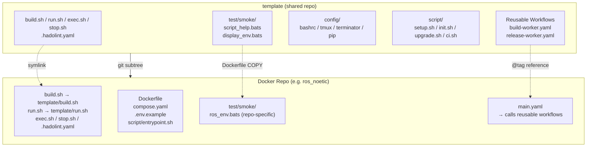
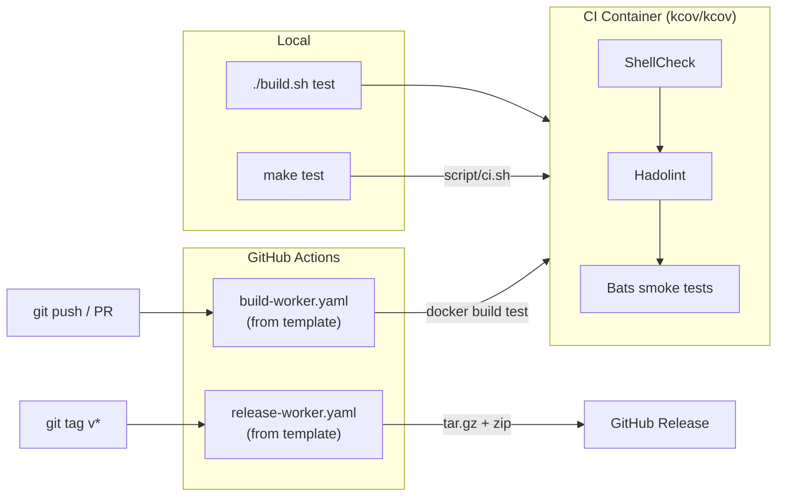

# template

[](https://github.com/ycpss91255-docker/template/actions/workflows/self-test.yaml)
[](https://codecov.io/gh/ycpss91255-docker/template)


[](./LICENSE)

Shared template for Docker container repos in the [ycpss91255-docker](https://github.com/ycpss91255-docker) organization.

**[English](README.md)** | **[繁體中文](doc/readme/README.zh-TW.md)** | **[简体中文](doc/readme/README.zh-CN.md)** | **[日本語](doc/readme/README.ja.md)**

---

## Table of Contents

- [TL;DR](#tldr)
- [Overview](#overview)
- [Quick Start](#quick-start)
- [CI Reusable Workflows](#ci-reusable-workflows)
- [Running Template Tests](#running-template-tests)
- [Tests](#tests)
- [Directory Structure](#directory-structure)

---

## TL;DR

```bash
# New repo: add subtree + init
git subtree add --prefix=template \
    git@github.com:ycpss91255-docker/template.git main --squash
./template/script/init.sh

# Upgrade to latest
make upgrade-check   # check
make upgrade         # pull + update version + workflow tag

# Run CI
make test            # ShellCheck + Bats + Kcov
make help            # show all commands
```

## Overview

This repo consolidates shared scripts, tests, and CI workflows used across all Docker container repos. Instead of maintaining identical files in 15+ repos, each repo pulls this template as a **git subtree** and uses symlinks.

### Architecture



### CI/CD Flow



### What's included

| File | Description |
|------|-------------|
| `build.sh` | Build containers (calls `script/setup.sh` for `.env` generation) |
| `run.sh` | Run containers (X11/Wayland support) |
| `exec.sh` | Exec into running containers |
| `stop.sh` | Stop and remove containers |
| `script/setup.sh` | Auto-detect system parameters and generate `.env` |
| `config/` | Shell configs (bashrc, tmux, terminator, pip) |
| `test/smoke/` | Shared smoke tests for repos |
| `.hadolint.yaml` | Shared Hadolint rules |
| `Makefile` | Repo entry (`make build`, `make run`, `make stop`, etc.) |
| `Makefile.ci` | Template CI entry (`make test`, `make -f Makefile.ci lint`, etc.) |
| `script/init.sh` | First-time symlink setup |
| `script/upgrade.sh` | Subtree version upgrade |
| `script/ci.sh` | CI pipeline (local + remote) |
| `.github/workflows/` | Reusable CI workflows (build + release) |

### What stays in each repo (not shared)

- `Dockerfile`
- `compose.yaml`
- `.env.example`
- `script/entrypoint.sh`
- `doc/` and `README.md`
- Repo-specific smoke tests

## Quick Start

### Adding to a new repo

```bash
# 1. Add subtree
git subtree add --prefix=template \
    git@github.com:ycpss91255-docker/template.git main --squash

# 2. Initialize symlinks (one command)
./template/script/init.sh
```

### Updating

```bash
# Check if update available
make upgrade-check

# Upgrade to latest (subtree pull + version file + workflow tag)
make upgrade

# Or specify a version
./template/script/upgrade.sh v0.3.0
```

## CI Reusable Workflows

Repos replace local `build-worker.yaml` / `release-worker.yaml` with calls to this repo's reusable workflows:

```yaml
# .github/workflows/main.yaml
jobs:
  call-docker-build:
    uses: ycpss91255-docker/template/.github/workflows/build-worker.yaml@v1
    with:
      image_name: ros_noetic
      build_args: |
        ROS_DISTRO=noetic
        ROS_TAG=ros-base
        UBUNTU_CODENAME=focal

  call-release:
    needs: call-docker-build
    if: startsWith(github.ref, 'refs/tags/')
    uses: ycpss91255-docker/template/.github/workflows/release-worker.yaml@v1
    with:
      archive_name_prefix: ros_noetic
```

### build-worker.yaml inputs

| Input | Type | Required | Default | Description |
|-------|------|----------|---------|-------------|
| `image_name` | string | yes | - | Container image name |
| `build_args` | string | no | `""` | Multi-line KEY=VALUE build args |
| `build_runtime` | boolean | no | `true` | Whether to build runtime stage |

### release-worker.yaml inputs

| Input | Type | Required | Default | Description |
|-------|------|----------|---------|-------------|
| `archive_name_prefix` | string | yes | - | Archive name prefix |
| `extra_files` | string | no | `""` | Space-separated extra files |

## Running Template Tests

Using `Makefile.ci` (from template root):
```bash
make -f Makefile.ci test        # Full CI (ShellCheck + Bats + Kcov) via docker compose
make -f Makefile.ci lint        # ShellCheck only
make -f Makefile.ci clean       # Remove coverage reports
make help        # Show repo targets
make -f Makefile.ci help  # Show CI targets
```

Or directly:
```bash
./script/ci.sh          # Full CI via docker compose
./script/ci.sh --ci     # Run inside container (used by compose)
```

## Tests

- **136** template self-tests (`test/unit/`)
- **27** shared smoke tests (`test/smoke/`)

See [TEST.md](doc/test/TEST.md) for details.

## Directory Structure

```
template/
├── build.sh                          # Shared build script
├── run.sh                            # Shared run script (X11/Wayland)
├── exec.sh                           # Shared exec script
├── stop.sh                           # Shared stop script
├── config/                           # Shell/tool configs
│   ├── pip/
│   └── shell/
│       ├── bashrc
│       ├── terminator/
│       └── tmux/
├── script/
│   ├── setup.sh                      # .env generator
│   ├── init.sh                       # Symlink setup
│   ├── upgrade.sh                    # Subtree version upgrade
│   ├── ci.sh                         # CI pipeline (local + remote)
├── test/
│   ├── smoke/                   # Shared tests for repos
│   │   ├── test_helper.bash
│   │   ├── script_help.bats
│   │   └── display_env.bats
│   └── unit/                         # Template self-tests (132 tests)
├── Makefile                          # Repo entry (make build/run/stop/...)
├── Makefile.ci                       # Template CI entry (make test/lint/...)
├── compose.yaml                      # Docker CI runner
├── .hadolint.yaml                    # Shared Hadolint rules
├── .github/workflows/
│   ├── self-test.yaml                # Template CI (calls script/ci.sh)
│   ├── build-worker.yaml             # Reusable build workflow
│   └── release-worker.yaml           # Reusable release workflow
├── doc/
│   ├── readme/                       # README translations
│   ├── test/                         # TEST.md + translations
│   └── changelog/                    # CHANGELOG.md + translations
├── .codecov.yaml
├── .gitignore
├── LICENSE
└── README.md
```
