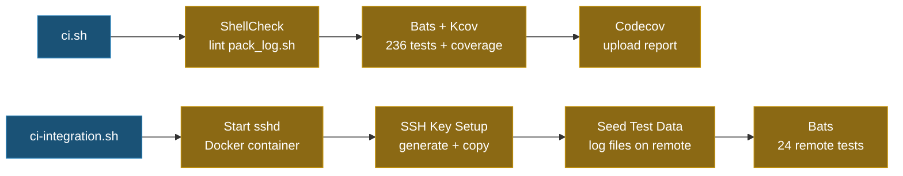

# Pack Log [](https://github.com/ycpss91255/pack_log/actions) [](https://codecov.io/gh/ycpss91255/pack_log)

> **Language**: English | [繁體中文](doc/README.zh-TW.md) | [简体中文](doc/README.zh-CN.md) | [日本語](doc/README.ja.md)


[English] | [繁體中文](./README.zh-TW.md)

> **TL;DR** — Single-file Bash script that connects to remote hosts via SSH, finds log files by time range, and transfers them back locally via rsync/scp/sftp. 100% test coverage with Bats + Kcov.
>
> ```bash
> ./pack_log.sh -n 1 -s 20260115-000000 -e 20260115-235959   # By host number
> ./pack_log.sh -u myuser@10.90.68.188 -s ... -e ...          # By user@host
> ./pack_log.sh -l -s ... -e ...                               # Local mode
> ```

A single-file log collection tool designed for robotic fleet deployments. It automates SSH connection setup, time-based log file discovery with special token resolution, and file transfer back to the local machine.

## Features

- **Multi-Host Support**: Pre-configured host list with interactive selection, or direct `user@host` input.
- **Smart Log Discovery**: Token system for dynamic path resolution — environment variables (`<env:VAR>`), shell commands (`<cmd:command>`), date formats (`<date:%Y%m%d>`), and file extension filters (`<suffix:.ext>`).
- **Time-Range Filtering**: Finds log files within a specified time window with automatic boundary expansion.
- **Auto SSH Key Management**: Creates SSH keys, copies them to remote hosts, and handles host key rotation automatically.
- **Flexible Transfer**: Supports rsync, scp, and sftp with automatic tool detection and fallback.
- **Local Mode**: Run without SSH for local log collection.
- **100% Test Coverage**: 260 tests across unit, local integration, and remote integration test suites.

## Quick Start

### Basic Usage

```bash
# Select host interactively
./pack_log.sh -s 20260115-000000 -e 20260115-235959

# By host number (from HOSTS array)
./pack_log.sh -n 1 -s 20260115-000000 -e 20260115-235959

# Direct user@host
./pack_log.sh -u myuser@10.90.68.188 -s 20260115-000000 -e 20260115-235959

# Local mode (no SSH)
./pack_log.sh -l -s 20260115-000000 -e 20260115-235959

# Custom output folder + verbose
./pack_log.sh -n 1 -s 20260115-000000 -e 20260115-235959 -o /tmp/my_logs -v
```

### Command-Line Options

| Option | Description |
|--------|-------------|
| `-n, --number` | Host number (from `HOSTS` array) |
| `-u, --userhost <user@host>` | Direct SSH target |
| `-l, --local` | Local mode (no SSH) |
| `-s, --start <YYYYmmdd-HHMMSS>` | Start time |
| `-e, --end <YYYYmmdd-HHMMSS>` | End time |
| `-o, --output <path>` | Output folder path (default: `log_pack`) |
| `-v, --verbose` | Enable verbose output |
| `--very-verbose` | Enable debug output |
| `--extra-verbose` | Enable trace output (`set -x`) |
| `-h, --help` | Show help message |

## Architecture

### Execution Pipeline

```mermaid
graph LR
    A["pack_log.sh\nmain()"]:::entry

    A --> B["option_parser\ngetopt CLI parsing"]:::step
    B --> C["host_handler\nresolve target host"]:::step
    C --> D["time_handler\nvalidate time range"]:::step
    D --> E{"HOST == local?"}:::decision

    E -->|No| F["ssh_handler\nSSH key + connection"]:::step
    F --> G["get_tools_checker\nrsync / scp / sftp"]:::step
    G --> H["folder_creator"]:::step

    E -->|Yes| H

    H --> I["get_log\nfind + copy files"]:::step
    I --> J{"HOST == local?"}:::decision

    J -->|No| K["file_sender\ntransfer to local"]:::step
    K --> L["Done"]:::output
    J -->|Yes| L

    classDef entry fill:#1a5276,color:#fff,stroke:#2980b9
    classDef step fill:#8B6914,color:#fff,stroke:#c8960c
    classDef decision fill:#6c3483,color:#fff,stroke:#8e44ad
    classDef output fill:#1e8449,color:#fff,stroke:#27ae60
```



### LOG_PATHS Token System

Log paths support dynamic tokens resolved at runtime on the target host:

| Token | Description | Example |
|-------|-------------|---------|
| `<env:VAR>` | Remote environment variable | `<env:HOME>/logs` |
| `<cmd:command>` | Remote shell command output | `<cmd:hostname>` |
| `<date:format>` | Date format for time filtering | `<date:%Y%m%d-%H%M%S>` |
| `<suffix:ext>` | File extension filter | `<suffix:.pcd>` |

**Token processing chain**: `string_handler` → `special_string_parser` → `get_remote_value`

**Example LOG_PATHS entry**:
```bash
'<env:HOME>/ros-docker/AMR/myuser/log_core::corenavi_auto.<cmd:hostname>.<env:USER>.log.INFO.<date:%Y%m%d-%H%M%S>*'
```

### Command Execution Model

All remote commands are executed through `execute_cmd()`, which pipes the command string into `bash -ls` (locally or via SSH). This approach avoids shell escaping issues. `execute_cmd_from_array()` handles null-delimited array piping for file operations.

## Configuration

Edit the `HOSTS` and `LOG_PATHS` arrays at the top of `pack_log.sh`:

```bash
# Target hosts: "display_name::user@host"
declare -a HOSTS=(
  "server01::myuser@10.90.68.188"
  "server02::myuser@10.90.68.191"
)

# Log paths: "<path>::<file_pattern>"
declare -a LOG_PATHS=(
  '<env:HOME>/logs::app_<date:%Y%m%d%H%M%S>*<suffix:.log>'
  '<env:HOME>/config::node_config.yaml'
)
```

## Project Structure

```text
.
├── pack_log.sh                          # Main script (~1200 lines)
├── ci.sh                                # Unit test CI entry point
├── ci-integration.sh                    # Integration test CI entry point
├── docker-compose.yaml                  # Unit test Docker environment
├── docker-compose.integration.yaml      # Integration test Docker environment
├── .codecov.yaml                        # Codecov configuration
├── .gitignore
│
├── .github/workflows/
│   ├── main.yaml                        # CI entry workflow
│   └── test-worker.yaml                 # Test jobs (unit + integration)
│
├── test/
│   ├── test_helper.bash                 # Shared bats test helper
│   ├── test_log_functions.bats          # Log function tests (11)
│   ├── test_support_functions.bats      # Support function tests (31)
│   ├── test_option_parser.bats          # Option parser tests (36)
│   ├── test_host_handler.bats           # Host handler tests (22)
│   ├── test_string_handler.bats         # String/token handler tests (28)
│   ├── test_file_finder.bats            # File finder tests (20)
│   ├── test_file_ops.bats              # File operation tests (28)
│   ├── test_ssh_handler.bats            # SSH handler tests (13)
│   ├── test_main.bats                   # Main pipeline tests (21)
│   ├── test_integration_local.bats      # Local integration tests (13)
│   ├── Dockerfile.sshd                  # SSH server for remote tests
│   ├── setup_remote_logs.sh             # Remote test data seeder
│   ├── lib/bats-mock                    # Bats mock library (symlink)
│   └── integration/
│       ├── test_helper.bash             # Remote test helper
│       └── test_remote.bats             # Remote integration tests (24)
│
└── bash_test_helper/                    # Reference submodule
```

## Testing

### Test Summary

| Category | Tests | Description |
|----------|------:|-------------|
| Unit Tests | 223 | Individual function testing |
| Local Integration | 13 | Full `main()` pipeline with local mode |
| Remote Integration | 24 | Full pipeline with real SSH to Docker sshd |
| **Total** | **260** | **100% code coverage** |

### Run Tests

```bash
# Unit tests + local integration + ShellCheck + coverage (requires Docker)
./ci.sh

# Remote integration tests (requires Docker)
./ci-integration.sh
```

### CI Pipeline



### Remote Integration Test Architecture

```text
┌───────────────────────┐      SSH (port 22)      ┌───────────────────────┐
│  integration container│ ◄──────────────────────► │    sshd container     │
│  (kcov/kcov)          │                          │    (ubuntu:22.04)     │
│                       │                          │                       │
│  • bats test runner   │                          │  • openssh-server     │
│  • openssh-client     │                          │  • rsync              │
│  • rsync / sshpass    │                          │  • testuser + key     │
│  • pack_log.sh        │                          │  • pre-seeded logs    │
└───────────────────────┘                          └───────────────────────┘
```

## Dependencies

To run CI locally, you need:
- **Docker** + **Docker Compose**

The CI containers automatically install:
- **Bats** (core + assert + file + support): Test framework
- **ShellCheck**: Static analysis
- **Kcov**: Coverage reporting
- **openssh-client / rsync / sshpass**: SSH and file transfer tools

## Conventions

- Script uses `set -euo pipefail` — all errors are fatal
- Functions use `local -n` (nameref) for output parameters
- SSH key path is fixed at `~/.ssh/get_log`
- ShellCheck compliance enforced in CI (`-S error` level)
- `BASH_SOURCE` guard pattern for testability:
  ```bash
  if [[ "${BASH_SOURCE[0]}" == "${0}" ]]; then
    main "$@"
  fi
  ```
