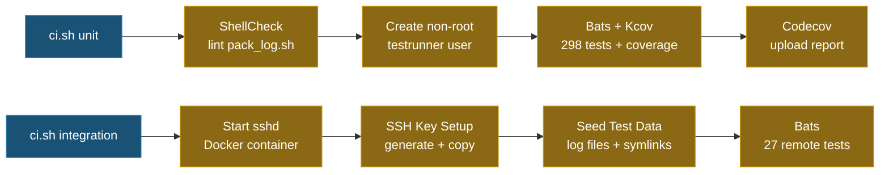

# Testing

> **Language**: English | [繁體中文](doc/TEST.zh-TW.md) | [简体中文](doc/TEST.zh-CN.md) | [日本語](doc/TEST.ja.md)

## Test Summary

| Category | Tests | Description |
|----------|------:|-------------|
| Unit Tests | 277 | Individual function testing |
| Local Integration | 21 | Full `main()` pipeline with local mode |
| Remote Integration | 30 | Full pipeline with real SSH to Docker sshd |
| **Total** | **328** | **100% code coverage** |

## Run Tests

```bash
# All tests (requires Docker + Docker Compose)
./ci.sh

# Unit tests + ShellCheck + coverage only
./ci.sh unit

# Remote integration tests only
./ci.sh integration
```

### Run a Single Test File (requires local bats + libraries)

```bash
bats test/test_option_parser.bats
```

### Run a Specific Test by Name

```bash
bats test/test_option_parser.bats -f "parses -n flag"
```

## Test Architecture

### Unit Tests

Test files are in `test/`, with `.bats` extension. The shared helper (`test/test_helper.bash`) auto-loads bats-support, bats-assert, bats-file, and bats-mock.

| Test File | Tests | Scope |
|-----------|------:|-------|
| `test_log_functions.bats` | 20 | Log output, verbosity, i18n, file descriptor management |
| `test_support_functions.bats` | 37 | `have_sudo_access`, `pkg_install_handler`, `execute_cmd`, `date_format` |
| `test_option_parser.bats` | 48 | CLI argument parsing, `SAVE_FOLDER` default, `--dry-run`, `--extra-verbose` |
| `test_host_handler.bats` | 21 | Host resolution (`-n`, `-u`, `-l`), interactive mode |
| `test_string_handler.bats` | 37 | Token parsing (`<env:>`, `<cmd:>`, `<date:>`, `<suffix:>`), path splitting |
| `test_file_finder.bats` | 29 | Date filtering, boundary expansion, time tolerance, symlink support |
| `test_file_ops.bats` | 42 | `folder_creator`, `file_copier`, `file_sender`, `get_log`, `file_cleaner` |
| `test_ssh_handler.bats` | 13 | SSH key creation, key copy, host key rotation, retry logic |
| `test_main.bats` | 30 | Full pipeline (local/remote), dry-run, transfer failure prompt |

### Local Integration Tests

`test/test_integration_local.bats` (17 tests) — runs the full `main()` pipeline with `-l` (local mode):

- Config files, date-filtered files, suffix filtering
- Multiple LOG_PATHS, empty directories, no files in range
- `<env:>` and `<cmd:>` token resolution
- Output folder structure and `/tmp` placement
- Symlink file collection
- Resolved path display
- Cross-date folder expansion (e.g., `AvoidStop_<date:%Y-%m-%d>` spans multiple days)

### Remote Integration Tests

`test/integration/test_remote.bats` (27 tests) — runs the full pipeline with actual SSH to a Docker sshd container:

- SSH connectivity, remote command execution
- File transfer with rsync, scp, sftp (each with content verification)
- `<cmd:hostname>`, `<env:HOME>` token resolution on remote
- Date format filtering: `%Y%m%d%H%M%S`, `%Y%m%d-%H%M%S`, `%s`, `%Y-%m-%d-%H-%M-%S`
- Suffix filtering, mixed LOG_PATHS
- Directory structure preservation after transfer
- Out-of-range file exclusion (false positive check)
- Symlink file discovery and transfer
- SAVE_FOLDER preserved in `/tmp` after success
- `script.log` and resolved path in output

## CI Pipeline



### Remote Integration Test Architecture

```text
┌───────────────────────┐      SSH (port 22)      ┌───────────────────────┐
│  integration container│ ◄──────────────────────► │    sshd container     │
│  (kcov/kcov)          │                          │    (ubuntu:22.04)     │
│                       │                          │                       │
│  • bats test runner   │                          │  • openssh-server     │
│  • openssh-client     │                          │  • rsync              │
│  • rsync / sshpass    │                          │  • testuser + key     │
│  • pack_log.sh        │                          │  • pre-seeded logs    │
│                       │                          │  • symlink test data  │
└───────────────────────┘                          └───────────────────────┘
```

## CI Environment

- **Unit tests** run as a **non-root** user (`testrunner`) inside Docker for realistic permission testing
- `sudo` and `rsync` are installed so all tests execute without skipping
- **ShellCheck** enforces `shellcheck -x -S error pack_log.sh`
- **Kcov** generates coverage reports with `KCOV_EXCL_START/STOP` and `KCOV_EXCL_LINE` markers for deployment-specific and runtime-only branches

## Dependencies

To run CI locally, you need:
- **Docker** + **Docker Compose**

The CI containers automatically install:
- **Bats** (core + assert + file + support): Test framework
- **ShellCheck**: Static analysis
- **Kcov**: Coverage reporting
- **openssh-client / rsync / sshpass / sudo**: SSH, file transfer, and permission tools

## TDD Workflow

This project follows Test-Driven Development:

1. **Write tests first**: Add or modify test cases in the corresponding `test/test_*.bats`
2. **Confirm red**: Run `bats test/test_xxx.bats` to verify the new test fails
3. **Implement**: Modify `pack_log.sh` to make the test pass
4. **Confirm green**: Run `bats test/` to verify all tests pass
5. **CI verification**: Run `./ci.sh unit` to ensure ShellCheck + full test suite + coverage pass

## Test Conventions

- Test helper (`test/test_helper.bash`) uses `set +u +o pipefail` (keeps `-e` for bats failure detection)
- `run bash -c` subshells use `env -u LD_PRELOAD -u BASH_ENV` to prevent kcov interference
- Variables declared with `declare` in `pack_log.sh` become local scope when sourced; re-initialize in each test's `setup()`
- Tests requiring `sudo` skip with message when `sudo` is not available
- Use file-based counters (not variables) for mock call counting inside `$()` subshells
