# Pack Log [](https://github.com/ycpss91255/pack_log/actions) [](https://codecov.io/gh/ycpss91255/pack_log)


> **語言**: [English](../README.md) | 繁體中文 | [简体中文](README.zh-CN.md) | [日本語](README.ja.md)

> **TL;DR** — 單檔 Bash 腳本，透過 SSH 連線到遠端主機，依時間範圍尋找 log 檔案，再用 rsync/scp/sftp 傳回本機。100% 測試覆蓋率（Bats + Kcov）。
>
> ```bash
> ./pack_log.sh -n 1 -s 260115-0000 -e 260115-2359   # 依主機編號
> ./pack_log.sh -u myuser@10.90.68.188 -s ... -e ...          # 直接指定 user@host
> ./pack_log.sh -l -s ... -e ...                               # 本機模式
> ```

專為機器人車隊部署設計的 log 收集工具。自動處理 SSH 連線建立、支援動態 token 解析的時間範圍 log 搜尋，以及檔案傳輸回本機。

## 功能特點

- **多主機支援**：預設主機列表互動式選擇，或直接輸入 `user@host`。
- **智慧 Log 搜尋**：Token 系統支援動態路徑解析 — 環境變數（`<env:VAR>`）、Shell 指令（`<cmd:command>`）、日期格式（`<date:%Y%m%d>`）、副檔名篩選（`<suffix:.ext>`）。
- **時間範圍篩選**：在指定時間窗口內搜尋 log 檔案，自動擴展邊界確保不遺漏。
- **自動 SSH 金鑰管理**：自動建立 SSH 金鑰、複製到遠端主機、處理 host key 更新。
- **彈性傳輸方式**：支援 rsync、scp、sftp，自動偵測可用工具並依序嘗試。
- **本機模式**：不走 SSH，直接在本機收集 log。
- **i18n 多語言支援**：英文、繁體中文、簡體中文、日文，透過 `--lang` 或 `$LANG` 切換。
- **Log 檔案輸出**：所有操作記錄寫入 `pack_log.log`。
- **模擬執行模式**：預覽會收集哪些檔案，不做任何複製或傳輸（`--dry-run`）。
- **傳輸重試與保留**：檔案傳輸（rsync/scp/sftp）失敗時自動重試，最多 3 次，每次間隔 5 秒，能處理 broken pipe 或網路中斷等暫時性錯誤。若全部重試失敗，遠端暫存資料夾會保留以供手動取回。
- **100% 測試覆蓋率**：318 個測試，涵蓋單元測試、本機整合測試、遠端整合測試。

## 快速開始

### 基本使用

```bash
# 互動式選擇主機
./pack_log.sh -s 260115-0000 -e 260115-2359

# 依主機編號（HOSTS 陣列）
./pack_log.sh -n 1 -s 260115-0000 -e 260115-2359

# 直接指定 user@host
./pack_log.sh -u myuser@10.90.68.188 -s 260115-0000 -e 260115-2359

# 本機模式（不走 SSH）
./pack_log.sh -l -s 260115-0000 -e 260115-2359

# 自訂輸出資料夾 + 詳細輸出
./pack_log.sh -n 1 -s 260115-0000 -e 260115-2359 -o /tmp/my_logs -v

# 使用 token 自訂輸出資料夾名稱
./pack_log.sh -n 7 -s 260309-0000 -e 260309-2359 -o 'corenavi_<date:%m%d>_#<num>'

# 模擬執行 — 查看會收集哪些檔案，不做實際操作
./pack_log.sh -n 1 -s 260115-0000 -e 260115-2359 --dry-run
```

### 命令列選項

| 選項 | 說明 |
|------|------|
| `-n, --number` | 主機編號（對應 `HOSTS` 陣列） |
| `-u, --userhost <user@host>` | 直接指定 SSH 目標 |
| `-l, --local` | 本機模式（不走 SSH） |
| `-s, --start <YYmmdd-HHMM>` | 起始時間 |
| `-e, --end <YYmmdd-HHMM>` | 結束時間 |
| `-o, --output <path>` | 輸出資料夾路徑（支援 `<num>`, `<name>`, `<date:fmt>` token） |
| `-v, --verbose` | 啟用詳細輸出 |
| `--very-verbose` | 啟用 debug 輸出 |
| `--extra-verbose` | 啟用追蹤輸出（`set -x`） |
| `--dry-run` | 模擬執行：搜尋檔案但不複製或傳輸 |
| `--lang <code>` | 語言：`en`、`zh-TW`、`zh-CN`、`ja` |
| `-h, --help` | 顯示說明 |
| `--version` | 顯示版本 |

## 架構

### 執行流程

```mermaid
graph LR
    A["pack_log.sh\nmain()"]:::entry

    A --> B["option_parser\ngetopt 解析命令列"]:::step
    B --> C["host_handler\n解析目標主機"]:::step
    C --> D["time_handler\n驗證時間範圍"]:::step
    D --> E{"HOST == local?"}:::decision

    E -->|否| F["ssh_handler\nSSH 金鑰 + 連線"]:::step
    F --> G["get_tools_checker\nrsync / scp / sftp"]:::step
    G --> H["folder_creator"]:::step

    E -->|是| H

    H --> I["get_log\n搜尋 + 複製檔案"]:::step
    I --> J{"HOST == local?"}:::decision

    J -->|否| K["file_sender\n傳輸回本機"]:::step
    K --> L["完成"]:::output
    J -->|是| L

    classDef entry fill:#1a5276,color:#fff,stroke:#2980b9
    classDef step fill:#8B6914,color:#fff,stroke:#c8960c
    classDef decision fill:#6c3483,color:#fff,stroke:#8e44ad
    classDef output fill:#1e8449,color:#fff,stroke:#27ae60
```



### LOG_PATHS Token 系統

Log 路徑支援在執行時對遠端主機動態解析的 token：

| Token | 說明 | 範例 |
|-------|------|------|
| `<env:VAR>` | 遠端環境變數 | `<env:HOME>/logs` |
| `<cmd:command>` | 遠端 shell 指令輸出 | `<cmd:hostname>` |
| `<date:format>` | 時間範圍篩選用的日期格式 | `<date:%Y%m%d-%H%M%S>` |
| `<suffix:ext>` | 副檔名篩選 | `<suffix:.pcd>` |

**處理鏈**：`string_handler` → `special_string_parser` → `get_remote_value`

**LOG_PATHS 範例**：
```bash
'<env:HOME>/ros-docker/AMR/myuser/log_core::corenavi_auto.<cmd:hostname>.<env:USER>.log.INFO.<date:%Y%m%d-%H%M%S>*'
```

### 指令執行模型

所有遠端指令都透過 `execute_cmd()` 執行，將指令字串以 pipe 方式送入 `bash -ls`（本機或 SSH），藉此避免 shell 跳脫問題。`execute_cmd_from_array()` 則處理以 null 分隔的陣列 pipe，用於檔案操作。

## 設定

編輯 `pack_log.sh` 頂部的 `HOSTS` 和 `LOG_PATHS` 陣列：

```bash
# 目標主機: "顯示名稱::user@host"
declare -a HOSTS=(
  "server01::myuser@10.90.68.188"
  "server02::myuser@10.90.68.191"
)

# Log 路徑: "<路徑>::<檔案樣式>"
declare -a LOG_PATHS=(
  '<env:HOME>/logs::app_<date:%Y%m%d%H%M%S>*<suffix:.log>'
  '<env:HOME>/config::node_config.yaml'
)
```

## 專案目錄結構

```text
.
├── pack_log.sh                          # 主腳本（約 2060 行）
├── ci.sh                                # CI 入口（unit / integration / all）
├── docker-compose.yaml                  # Docker 服務（ci + sshd + integration）
├── .codecov.yaml                        # Codecov 設定
├── .gitignore
│
├── .github/workflows/
│   ├── main.yaml                        # CI 入口 workflow
│   └── test-worker.yaml                 # 測試 jobs（unit + integration）
│
├── test/
│   ├── test_helper.bash                 # 共用 bats 測試 helper
│   ├── test_log_functions.bats          # 日誌函式測試 (20)
│   ├── test_support_functions.bats      # 輔助函式測試 (37)
│   ├── test_option_parser.bats          # 選項解析測試 (44)
│   ├── test_host_handler.bats           # 主機選擇測試 (22)
│   ├── test_string_handler.bats         # 字串/Token 處理測試 (27)
│   ├── test_file_finder.bats            # 檔案搜尋測試 (20)
│   ├── test_file_ops.bats              # 檔案操作測試 (31)
│   ├── test_ssh_handler.bats            # SSH 處理測試 (13)
│   ├── test_main.bats                   # Main 流程測試 (17)
│   ├── test_integration_local.bats      # 本機整合測試 (13)
│   ├── Dockerfile.sshd                  # 遠端測試用 SSH 伺服器
│   ├── setup_remote_logs.sh             # 遠端測試資料建立腳本
│   ├── lib/bats-mock                    # Bats mock 函式庫（symlink）
│   └── integration/
│       ├── test_helper.bash             # 遠端測試 helper
│       └── test_remote.bats             # 遠端整合測試 (24)
│
├── doc/
│   ├── README.zh-TW.md                  # 繁體中文 README
│   ├── README.zh-CN.md                  # 簡體中文 README
│   └── README.ja.md                     # 日文 README
│
└── bash_test_helper/                    # 參考架構子模組
```

## 測試

318 個測試（274 單元 + 17 本機整合 + 27 遠端整合），**100% 程式碼覆蓋率**。詳見 **[TEST.zh-TW.md](../TEST.zh-TW.md)**。

```bash
./ci.sh              # 全部測試（需要 Docker）
./ci.sh unit         # 單元 + ShellCheck + 覆蓋率
./ci.sh integration  # 遠端整合測試
```

## 重要慣例

- 腳本使用 `set -euo pipefail`，所有錯誤皆為致命錯誤
- 函式使用 REPLY 慣例作為輸出（`REPLY`, `REPLY_TYPE`, `REPLY_STR` 等）
- SSH 金鑰路徑固定為 `~/.ssh/get_log`
- CI 中強制執行 ShellCheck 合規檢查（`-S error` 等級）
- 使用 `BASH_SOURCE` 守衛模式確保可測試性：
  ```bash
  if [[ "${BASH_SOURCE[0]}" == "${0}" ]]; then
    main "$@"
  fi
  ```
