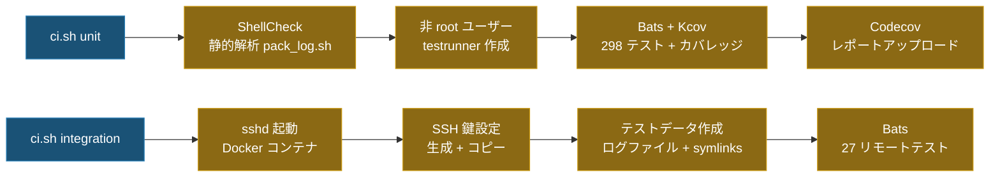

# テスト

> **言語**: [English](../TEST.md) | [繁體中文](TEST.zh-TW.md) | [简体中文](TEST.zh-CN.md) | 日本語

## テスト概要

| カテゴリ | 件数 | 説明 |
|----------|-----:|------|
| ユニットテスト | 277 | 個別関数のテスト |
| ローカル結合テスト | 21 | `main()` フルパイプライン（ローカルモード） |
| リモート結合テスト | 30 | フルパイプライン（Docker sshd への実 SSH 接続） |
| **合計** | **328** | **100% コードカバレッジ** |

## テスト実行

```bash
# 全テスト実行（Docker + Docker Compose が必要）
./ci.sh

# ユニットテスト + ShellCheck + カバレッジのみ
./ci.sh unit

# リモート結合テストのみ
./ci.sh integration
```

### 単一テストファイルの実行（ローカルに bats + ライブラリが必要）

```bash
bats test/test_option_parser.bats
```

### テスト名でフィルタ実行

```bash
bats test/test_option_parser.bats -f "parses -n flag"
```

## テストアーキテクチャ

### ユニットテスト

テストファイルは `test/` ディレクトリ内、拡張子 `.bats`。共有ヘルパー（`test/test_helper.bash`）が bats-support、bats-assert、bats-file、bats-mock を自動ロードします。

| テストファイル | 件数 | 範囲 |
|---------------|-----:|------|
| `test_log_functions.bats` | 20 | ログ出力、詳細度、i18n、ファイルディスクリプタ管理 |
| `test_support_functions.bats` | 37 | `have_sudo_access`、`pkg_install_handler`、`execute_cmd`、`date_format` |
| `test_option_parser.bats` | 48 | CLI 引数解析、`SAVE_FOLDER` デフォルト値、`--dry-run`、`--extra-verbose` |
| `test_host_handler.bats` | 21 | ホスト解決（`-n`、`-u`、`-l`）、インタラクティブモード |
| `test_string_handler.bats` | 37 | トークン解析（`<env:>`、`<cmd:>`、`<date:>`、`<suffix:>`）、パス分割 |
| `test_file_finder.bats` | 29 | 日付フィルタ、境界拡張、時間許容範囲、symlink サポート |
| `test_file_ops.bats` | 42 | `folder_creator`、`file_copier`、`file_sender`、`get_log`、`file_cleaner` |
| `test_ssh_handler.bats` | 13 | SSH 鍵作成、鍵コピー、ホスト鍵ローテーション、リトライロジック |
| `test_main.bats` | 30 | フルパイプライン（ローカル/リモート）、dry-run、転送失敗インタラクティブプロンプト |

### ローカル結合テスト

`test/test_integration_local.bats`（16 テスト）— `-l`（ローカルモード）でフル `main()` パイプラインを実行：

- 設定ファイル、日付フィルタファイル、拡張子フィルタ
- 複数 LOG_PATHS、空ディレクトリ、範囲内ファイルなし
- `<env:>` と `<cmd:>` トークン解決
- 出力フォルダ構造と `/tmp` 配置
- Symlink ファイル収集
- 解決済みパス表示
- 日付横断フォルダ展開（例: `AvoidStop_<date:%Y-%m-%d>` が複数日にわたる場合）

### リモート結合テスト

`test/integration/test_remote.bats`（27 テスト）— Docker sshd コンテナへの実 SSH 接続でフルパイプラインを実行：

- SSH 接続、リモートコマンド実行
- rsync、scp、sftp ファイル転送（コンテンツ検証付き）
- リモートでの `<cmd:hostname>`、`<env:HOME>` トークン解決
- 日付フォーマットフィルタ：`%Y%m%d%H%M%S`、`%Y%m%d-%H%M%S`、`%s`、`%Y-%m-%d-%H-%M-%S`
- 拡張子フィルタ、混合 LOG_PATHS
- 転送後のディレクトリ構造保持
- 範囲外ファイルの除外（誤検出防止）
- Symlink ファイルの検出と転送
- 成功後 SAVE_FOLDER を `/tmp` に保持
- `script.log` と解決済みパス表示

## CI パイプライン



### リモート結合テストアーキテクチャ

```text
┌───────────────────────┐      SSH (port 22)      ┌───────────────────────┐
│  integration コンテナ │ ◄──────────────────────► │    sshd コンテナ      │
│  (kcov/kcov)          │                          │    (ubuntu:22.04)     │
│                       │                          │                       │
│  • bats テストランナー│                          │  • openssh-server     │
│  • openssh-client     │                          │  • rsync              │
│  • rsync / sshpass    │                          │  • testuser + 鍵     │
│  • pack_log.sh        │                          │  • 事前作成ログファイル│
│                       │                          │  • symlink テストデータ│
└───────────────────────┘                          └───────────────────────┘
```

## CI 環境

- **ユニットテスト**は Docker 内で**非 root** ユーザー（`testrunner`）として実行し、権限テストの現実性を確保
- `sudo` と `rsync` をインストールし、全テストをスキップなしで実行
- **ShellCheck** が `shellcheck -x -S error pack_log.sh` を強制
- **Kcov** がカバレッジレポートを生成、`KCOV_EXCL_START/STOP` と `KCOV_EXCL_LINE` でデプロイ固有および runtime-only ブランチを除外

## 依存関係

ローカルで CI を実行するには：
- **Docker** + **Docker Compose**

CI コンテナが自動インストール：
- **Bats**（core + assert + file + support）：テストフレームワーク
- **ShellCheck**：静的解析ツール
- **Kcov**：カバレッジレポート生成
- **openssh-client / rsync / sshpass / sudo**：SSH、ファイル転送、権限ツール

## TDD ワークフロー

本プロジェクトはテスト駆動開発を採用：

1. **テストを先に書く**：対応する `test/test_*.bats` にテストケースを追加・変更
2. **レッド確認**：`bats test/test_xxx.bats` で新テストが失敗することを確認
3. **実装**：`pack_log.sh` を変更してテストをパス
4. **グリーン確認**：`bats test/` で全テストがパスすることを確認
5. **CI 検証**：`./ci.sh unit` で ShellCheck + フルテスト + カバレッジをパス

## テスト慣例

- テストヘルパー（`test/test_helper.bash`）は `set +u +o pipefail` を使用（bats の失敗検出のため `-e` を保持）
- `run bash -c` サブシェルは `env -u LD_PRELOAD -u BASH_ENV` で kcov の干渉を防止
- `pack_log.sh` で `declare` 宣言された変数は source 時に local スコープになるため、各テストの `setup()` で再初期化が必要
- `sudo` が必要なテストは `sudo` が利用できない場合 skip メッセージでスキップ
- `$()` サブシェル内では変数ではなくファイルベースのカウンターでモック呼び出し回数を追跡
