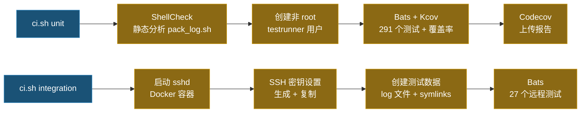

# 测试

> **语言**: [English](../TEST.md) | [繁體中文](TEST.zh-TW.md) | 简体中文 | [日本語](TEST.ja.md)

## 测试总览

| 类别 | 数量 | 说明 |
|------|-----:|------|
| 单元测试 | 278 | 单个函数测试 |
| 本机集成测试 | 17 | 完整 `main()` 流程（本机模式） |
| 远程集成测试 | 30 | 完整流程（通过 SSH 连接到 Docker sshd） |
| **合计** | **325** | **100% 代码覆盖率** |

## 运行测试

```bash
# 运行全部测试（需要 Docker + Docker Compose）
./ci.sh

# 只运行单元测试 + ShellCheck + 覆盖率
./ci.sh unit

# 只运行远程集成测试
./ci.sh integration
```

### 运行单个测试文件（需本机安装 bats + 相关库）

```bash
bats test/test_option_parser.bats
```

### 运行特定测试（按名称过滤）

```bash
bats test/test_option_parser.bats -f "parses -n flag"
```

## 测试架构

### 单元测试

测试文件位于 `test/` 目录下，扩展名为 `.bats`。辅助模块（`test/test_helper.bash`）自动加载 bats-support、bats-assert、bats-file 和 bats-mock。

| 测试文件 | 数量 | 范围 |
|----------|-----:|------|
| `test_log_functions.bats` | 20 | Log 输出、详细程度、i18n、文件描述符管理 |
| `test_support_functions.bats` | 37 | `have_sudo_access`、`pkg_install_handler`、`execute_cmd`、`date_format` |
| `test_option_parser.bats` | 48 | 命令行参数解析、`SAVE_FOLDER` 默认值、`--dry-run`、`--extra-verbose` |
| `test_host_handler.bats` | 21 | 主机解析（`-n`、`-u`、`-l`）、交互模式 |
| `test_string_handler.bats` | 37 | Token 解析（`<env:>`、`<cmd:>`、`<date:>`、`<suffix:>`）、路径分割 |
| `test_file_finder.bats` | 26 | 日期筛选、边界扩展、时间容差、symlink 支持 |
| `test_file_ops.bats` | 42 | `folder_creator`、`file_copier`、`file_sender`、`get_log`、`file_cleaner` |
| `test_ssh_handler.bats` | 13 | SSH 密钥创建、密钥复制、host key 轮换、重试机制 |
| `test_main.bats` | 30 | 完整流程（本机/远程）、dry-run、传输失败交互提示 |

### 本机集成测试

`test/test_integration_local.bats`（16 个测试）— 使用 `-l`（本机模式）运行完整 `main()` 流程：

- 配置文件、日期筛选文件、后缀名筛选
- 多个 LOG_PATHS、空目录、范围内无文件
- `<env:>` 和 `<cmd:>` token 解析
- 输出文件夹结构与 `/tmp` 放置
- Symlink 文件收集
- 解析后路径显示
- 跨日期文件夹展开（如 `AvoidStop_<date:%Y-%m-%d>` 跨多天）

### 远程集成测试

`test/integration/test_remote.bats`（27 个测试）— 通过 SSH 连接到 Docker sshd 容器运行完整流程：

- SSH 连接、远程命令执行
- rsync、scp、sftp 文件传输（含内容验证）
- 远程 `<cmd:hostname>`、`<env:HOME>` token 解析
- 日期格式筛选：`%Y%m%d%H%M%S`、`%Y%m%d-%H%M%S`、`%s`、`%Y-%m-%d-%H-%M-%S`
- 后缀名筛选、混合 LOG_PATHS
- 传输后目录结构保留
- 范围外文件排除（防止误抓）
- Symlink 文件发现与传输
- 成功后 SAVE_FOLDER 保留在 `/tmp`
- `script.log` 与解析后路径显示

## CI 流程



### 远程集成测试架构

```text
┌───────────────────────┐      SSH (port 22)      ┌───────────────────────┐
│  integration 容器     │ ◄──────────────────────► │      sshd 容器        │
│  (kcov/kcov)          │                          │    (ubuntu:22.04)     │
│                       │                          │                       │
│  • bats 测试运行器    │                          │  • openssh-server     │
│  • openssh-client     │                          │  • rsync              │
│  • rsync / sshpass    │                          │  • testuser + 密钥   │
│  • pack_log.sh        │                          │  • 预创建的 log 文件  │
│                       │                          │  • symlink 测试数据   │
└───────────────────────┘                          └───────────────────────┘
```

## CI 环境

- **单元测试**以**非 root** 用户（`testrunner`）在 Docker 中运行，确保权限测试的真实性
- 安装 `sudo` 和 `rsync`，所有测试无需跳过
- **ShellCheck** 强制执行 `shellcheck -x -S error pack_log.sh`
- **Kcov** 生成覆盖率报告，使用 `KCOV_EXCL_START/STOP` 和 `KCOV_EXCL_LINE` 排除部署特定和 runtime-only 分支

## 依赖

本机运行 CI 需要：
- **Docker** + **Docker Compose**

CI 容器自动安装：
- **Bats**（core + assert + file + support）：测试框架
- **ShellCheck**：静态分析工具
- **Kcov**：覆盖率报告生成器
- **openssh-client / rsync / sshpass / sudo**：SSH、文件传输与权限工具

## TDD 开发流程

本项目采用测试驱动开发：

1. **先写测试**：在对应的 `test/test_*.bats` 中新增或修改测试用例
2. **确认红灯**：运行 `bats test/test_xxx.bats` 确认新测试失败
3. **实现功能**：修改 `pack_log.sh` 使测试通过
4. **确认绿灯**：运行 `bats test/` 确认所有测试通过
5. **CI 验证**：运行 `./ci.sh unit` 确认 ShellCheck + 完整测试 + 覆盖率通过

## 测试惯例

- 测试辅助模块（`test/test_helper.bash`）使用 `set +u +o pipefail`（保留 `-e` 以检测 bats 断言失败）
- `run bash -c` 子 shell 使用 `env -u LD_PRELOAD -u BASH_ENV` 防止 kcov 干扰
- `pack_log.sh` 中以 `declare` 声明的变量在 source 时会变成 local scope，需在每个测试的 `setup()` 中重新初始化
- 需要 `sudo` 的测试在 `sudo` 不可用时以 skip 消息跳过
- 在 `$()` 子 shell 中使用文件计数器（而非变量）追踪 mock 调用次数
