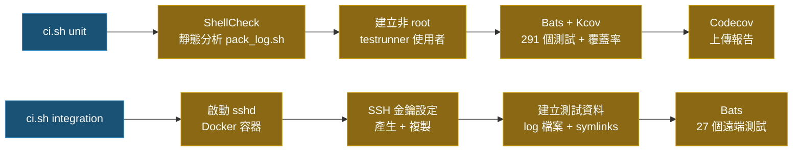

# 測試

> **語言**: [English](../TEST.md) | 繁體中文 | [简体中文](TEST.zh-CN.md) | [日本語](TEST.ja.md)

## 測試總覽

| 類別 | 數量 | 說明 |
|------|-----:|------|
| 單元測試 | 274 | 個別函式測試 |
| 本機整合測試 | 17 | 完整 `main()` 流程（本機模式） |
| 遠端整合測試 | 27 | 完整流程（透過 SSH 連線至 Docker sshd） |
| **合計** | **318** | **100% 程式碼覆蓋率** |

## 執行測試

```bash
# 執行全部測試（需要 Docker + Docker Compose）
./ci.sh

# 只跑單元測試 + ShellCheck + 覆蓋率
./ci.sh unit

# 只跑遠端整合測試
./ci.sh integration
```

### 跑單一測試檔案（本機需先安裝 bats + 相關 library）

```bash
bats test/test_option_parser.bats
```

### 跑特定測試（依名稱過濾）

```bash
bats test/test_option_parser.bats -f "parses -n flag"
```

## 測試架構

### 單元測試

測試檔案放在 `test/` 目錄下，副檔名為 `.bats`。輔助模組（`test/test_helper.bash`）會自動載入 bats-support、bats-assert、bats-file 和 bats-mock。

| 測試檔案 | 數量 | 範圍 |
|----------|-----:|------|
| `test_log_functions.bats` | 20 | Log 輸出、詳細程度、i18n、檔案描述符管理 |
| `test_support_functions.bats` | 37 | `have_sudo_access`、`pkg_install_handler`、`execute_cmd`、`date_format` |
| `test_option_parser.bats` | 48 | 命令列參數解析、`SAVE_FOLDER` 預設值、`--dry-run`、`--extra-verbose` |
| `test_host_handler.bats` | 21 | 主機解析（`-n`、`-u`、`-l`）、互動模式 |
| `test_string_handler.bats` | 37 | Token 解析（`<env:>`、`<cmd:>`、`<date:>`、`<suffix:>`）、路徑切割 |
| `test_file_finder.bats` | 26 | 日期篩選、邊界擴展、時間容差、symlink 支援 |
| `test_file_ops.bats` | 42 | `folder_creator`、`file_copier`、`file_sender`、`get_log`、`file_cleaner` |
| `test_ssh_handler.bats` | 13 | SSH 金鑰建立、金鑰複製、host key 輪替、重試機制 |
| `test_main.bats` | 30 | 完整流程（本機/遠端）、dry-run、傳輸失敗互動提示 |

### 本機整合測試

`test/test_integration_local.bats`（16 個測試）— 使用 `-l`（本機模式）執行完整 `main()` 流程：

- 設定檔、日期篩選檔案、副檔名篩選
- 多個 LOG_PATHS、空目錄、範圍內無檔案
- `<env:>` 和 `<cmd:>` token 解析
- 輸出資料夾結構與 `/tmp` 放置
- Symlink 檔案收集
- 解析後路徑顯示
- 跨日期資料夾展開（如 `AvoidStop_<date:%Y-%m-%d>` 跨多天）

### 遠端整合測試

`test/integration/test_remote.bats`（27 個測試）— 透過 SSH 連線至 Docker sshd 容器執行完整流程：

- SSH 連線、遠端命令執行
- rsync、scp、sftp 檔案傳輸（含內容驗證）
- 遠端 `<cmd:hostname>`、`<env:HOME>` token 解析
- 日期格式篩選：`%Y%m%d%H%M%S`、`%Y%m%d-%H%M%S`、`%s`、`%Y-%m-%d-%H-%M-%S`
- 副檔名篩選、混合 LOG_PATHS
- 傳輸後目錄結構保留
- 範圍外檔案排除（防止誤抓）
- Symlink 檔案發現與傳輸
- 成功後 SAVE_FOLDER 保留在 `/tmp`
- `script.log` 與解析後路徑顯示

## CI 流程



### 遠端整合測試架構

```text
┌───────────────────────┐      SSH (port 22)      ┌───────────────────────┐
│  integration 容器     │ ◄──────────────────────► │      sshd 容器        │
│  (kcov/kcov)          │                          │    (ubuntu:22.04)     │
│                       │                          │                       │
│  • bats 測試執行器    │                          │  • openssh-server     │
│  • openssh-client     │                          │  • rsync              │
│  • rsync / sshpass    │                          │  • testuser + 金鑰   │
│  • pack_log.sh        │                          │  • 預建立的 log 檔案  │
│                       │                          │  • symlink 測試資料   │
└───────────────────────┘                          └───────────────────────┘
```

## CI 環境

- **單元測試**以**非 root** 使用者（`testrunner`）在 Docker 中執行，確保權限測試的真實性
- 安裝 `sudo` 和 `rsync`，所有測試無需跳過
- **ShellCheck** 強制執行 `shellcheck -x -S error pack_log.sh`
- **Kcov** 產生覆蓋率報告，使用 `KCOV_EXCL_START/STOP` 和 `KCOV_EXCL_LINE` 排除部署特定和 runtime-only 分支

## 依賴

本機執行 CI 需要：
- **Docker** + **Docker Compose**

CI 容器會自動安裝：
- **Bats**（core + assert + file + support）：測試框架
- **ShellCheck**：靜態分析工具
- **Kcov**：覆蓋率報告產生器
- **openssh-client / rsync / sshpass / sudo**：SSH、檔案傳輸與權限工具

## TDD 開發流程

本專案採用測試驅動開發：

1. **先寫測試**：在對應的 `test/test_*.bats` 中新增或修改測試案例
2. **確認紅燈**：執行 `bats test/test_xxx.bats` 確認新測試失敗
3. **實作功能**：修改 `pack_log.sh` 使測試通過
4. **確認綠燈**：執行 `bats test/` 確認所有測試通過
5. **CI 驗證**：執行 `./ci.sh unit` 確認 ShellCheck + 完整測試 + 覆蓋率通過

## 測試慣例

- 測試輔助模組（`test/test_helper.bash`）使用 `set +u +o pipefail`（保留 `-e` 以偵測 bats 斷言失敗）
- `run bash -c` 子 shell 使用 `env -u LD_PRELOAD -u BASH_ENV` 防止 kcov 干擾
- `pack_log.sh` 中以 `declare` 宣告的變數在 source 時會變成 local scope，需在每個測試的 `setup()` 中重新初始化
- 需要 `sudo` 的測試在 `sudo` 不可用時會以 skip 訊息跳過
- 在 `$()` 子 shell 中使用檔案計數器（而非變數）追蹤 mock 呼叫次數
