# Pack Log [](https://github.com/ycpss91255/pack_log/actions) [](https://codecov.io/gh/ycpss91255/pack_log)


> **言語**: [English](../../README.md) | [繁體中文](README.zh-TW.md) | [简体中文](README.zh-CN.md) | 日本語

> **概要** — 単一ファイルの Bash スクリプトで、SSH 経由でリモートホストに接続し、時間範囲に基づいて log ファイルを検索し、rsync/scp/sftp でローカルに転送します。Bats + Kcov による 100% テストカバレッジ。
>
> ```bash
> ./pack_log.sh -n 1 -s 260115-0000 -e 260115-2359   # ホスト番号で指定
> ./pack_log.sh -u myuser@10.90.68.188 -s ... -e ...          # user@host を直接指定
> ./pack_log.sh -l -s ... -e ...                               # ローカルモード
> ```

ロボットフリート運用向けに設計された単一ファイルの log 収集ツールです。SSH 接続の自動確立、特殊トークン解析による時間ベースの log ファイル検索、およびローカルマシンへのファイル転送を自動化します。

## 機能

- **マルチホスト対応**：事前設定されたホストリストからの対話式選択、または `user@host` の直接入力が可能。
- **スマート log 検索**：トークンシステムによる動的パス解析 - 環境変数（`<env:VAR>`）、Shell コマンド（`<cmd:command>`）、日付フォーマット（`<date:%Y%m%d>`）、拡張子フィルタ（`<suffix:.ext>`）。
- **時間範囲フィルタリング**：指定した時間ウィンドウ内の log ファイルを検索し、境界を自動拡張して漏れを防止。
- **SSH 鍵の自動管理**：SSH 鍵の作成、リモートホストへのコピー、ホスト鍵の更新を自動処理。
- **柔軟な転送方式**：rsync、scp、sftp をサポートし、利用可能なツールを自動検出してフォールバック。
- **ローカルモード**：SSH を使用せず、ローカルで log を収集。
- **i18n 多言語対応**：英語、繁体字中国語、簡体字中国語、日本語を `--lang` または `$LANG` で切り替え。
- **ログファイル出力**：全操作を `pack_log.log` に記録。
- **ドライランモード**：収集対象ファイルをプレビュー（コピー・転送なし）（`--dry-run`）。
- **転送リトライと保持**：ファイル転送（rsync/scp/sftp）失敗時に自動リトライ（最大 3 回、5 秒間隔）。broken pipe やネットワーク障害などの一時的なエラーに対応。全リトライ失敗時はリモート一時フォルダを保持し、手動で取得可能。
- **100% テストカバレッジ**：単体テスト、ローカル結合テスト、リモート結合テストで合計 330 件のテスト。

## クイックスタート

### 基本的な使い方

```bash
# ホストを対話式に選択
./pack_log.sh -s 260115-0000 -e 260115-2359

# ホスト番号で指定（HOSTS 配列から）
./pack_log.sh -n 1 -s 260115-0000 -e 260115-2359

# user@host を直接指定
./pack_log.sh -u myuser@10.90.68.188 -s 260115-0000 -e 260115-2359

# ローカルモード（SSH なし）
./pack_log.sh -l -s 260115-0000 -e 260115-2359

# カスタム出力フォルダ + 詳細出力
./pack_log.sh -n 1 -s 260115-0000 -e 260115-2359 -o /tmp/my_logs -v

# トークンで出力フォルダ名をカスタマイズ
./pack_log.sh -n 7 -s 260309-0000 -e 260309-2359 -o 'corenavi_<date:%m%d>_#<num>'

# ドライラン — 収集対象ファイルを確認（実行なし）
./pack_log.sh -n 1 -s 260115-0000 -e 260115-2359 --dry-run
```

### コマンドラインオプション

| オプション | 説明 |
|------------|------|
| `-n, --number` | ホスト番号（`HOSTS` 配列に対応） |
| `-u, --userhost <user@host>` | SSH 接続先を直接指定 |
| `-l, --local` | ローカルモード（SSH なし） |
| `-s, --start <YYmmdd-HHMM>` | 開始時刻 |
| `-e, --end <YYmmdd-HHMM>` | 終了時刻 |
| `-o, --output <path>` | 出力フォルダパス（`<num>`, `<name>`, `<date:fmt>` トークン対応） |
| `-v, --verbose` | 詳細出力を有効化 |
| `--very-verbose` | デバッグ出力を有効化 |
| `--extra-verbose` | トレース出力を有効化（`set -x`） |
| `--dry-run` | シミュレーション実行：ファイル検索のみ（コピー・転送なし） |
| `--lang <code>` | 言語：`en`、`zh-TW`、`zh-CN`、`ja` |
| `-h, --help` | ヘルプメッセージを表示 |
| `--version` | バージョンを表示 |

## アーキテクチャ

### 実行パイプライン

```mermaid
graph LR
    A["pack_log.sh\nmain()"]:::entry

    A --> B["option_parser\ngetopt コマンドライン解析"]:::step
    B --> C["host_handler\n対象ホストの解決"]:::step
    C --> D["time_handler\n時間範囲の検証"]:::step
    D --> E{"HOST == local?"}:::decision

    E -->|いいえ| F["ssh_handler\nSSH 鍵 + 接続"]:::step
    F --> G["get_tools_checker\nrsync / scp / sftp"]:::step
    G --> H["folder_creator"]:::step

    E -->|はい| H

    H --> I["get_log\n検索 + ファイルコピー"]:::step
    I --> J{"HOST == local?"}:::decision

    J -->|いいえ| K["file_sender\nローカルへ転送"]:::step
    K --> L["完了"]:::output
    J -->|はい| L

    classDef entry fill:#1a5276,color:#fff,stroke:#2980b9
    classDef step fill:#8B6914,color:#fff,stroke:#c8960c
    classDef decision fill:#6c3483,color:#fff,stroke:#8e44ad
    classDef output fill:#1e8449,color:#fff,stroke:#27ae60
```



### LOG_PATHS トークンシステム

Log パスは、対象ホスト上で実行時に動的に解決されるトークンをサポートします：

| トークン | 説明 | 例 |
|----------|------|-----|
| `<env:VAR>` | リモート環境変数 | `<env:HOME>/logs` |
| `<cmd:command>` | リモート Shell コマンドの出力 | `<cmd:hostname>` |
| `<date:format>` | 時間フィルタリング用の日付フォーマット | `<date:%Y%m%d-%H%M%S>` |
| `<suffix:ext>` | ファイル拡張子フィルタ | `<suffix:.pcd>` |

**トークン処理チェーン**：`string_handler` → `special_string_parser` → `get_remote_value`

**LOG_PATHS の例**：
```bash
'<env:HOME>/ros-docker/AMR/myuser/log_core::corenavi_auto.<cmd:hostname>.<env:USER>.log.INFO.<date:%Y%m%d-%H%M%S>*'
```

### コマンド実行モデル

すべてのリモートコマンドは `execute_cmd()` を通じて実行され、コマンド文字列を `bash -ls`（ローカルまたは SSH 経由）にパイプします。このアプローチにより、Shell エスケープの問題を回避できます。`execute_cmd_from_array()` は、ファイル操作用に null 区切りの配列パイプを処理します。

## 設定

`pack_log.sh` の先頭にある `HOSTS` と `LOG_PATHS` 配列を編集してください：

```bash
# 対象ホスト: "表示名::user@host"
declare -a HOSTS=(
  "server01::myuser@10.90.68.188"
  "server02::myuser@10.90.68.191"
)

# Log パス: "<パス>::<ファイルパターン>"
declare -a LOG_PATHS=(
  '<env:HOME>/logs::app_<date:%Y%m%d%H%M%S>*<suffix:.log>'
  '<env:HOME>/config::node_config.yaml'
)
```

## プロジェクト構成

```text
.
├── pack_log.sh                          # メインスクリプト
├── ci.sh                                # CI エントリポイント（unit / integration / all）
├── docker-compose.yaml                  # Docker サービス（ci + sshd + integration）
├── .codecov.yaml                        # Codecov 設定
├── .gitignore
│
├── .github/workflows/
│   ├── main.yaml                        # CI エントリ workflow
│   └── test-worker.yaml                 # テストジョブ（unit + integration）
│
├── test/
│   ├── test_helper.bash                 # 共通 bats テストヘルパー
│   ├── test_log_functions.bats          # ログ関数テスト (20)
│   ├── test_support_functions.bats      # サポート関数テスト (37)
│   ├── test_option_parser.bats          # オプション解析テスト (44)
│   ├── test_host_handler.bats           # ホストハンドラテスト (22)
│   ├── test_string_handler.bats         # 文字列/トークン処理テスト (27)
│   ├── test_file_finder.bats            # ファイル検索テスト (20)
│   ├── test_file_ops.bats              # ファイル操作テスト (31)
│   ├── test_ssh_handler.bats            # SSH ハンドラテスト (13)
│   ├── test_main.bats                   # メインパイプラインテスト (17)
│   ├── test_integration_local.bats      # ローカル結合テスト (13)
│   ├── Dockerfile.sshd                  # リモートテスト用 SSH サーバー
│   ├── setup_remote_logs.sh             # リモートテストデータ作成スクリプト
│   ├── lib/bats-mock                    # Bats mock ライブラリ（symlink）
│   └── integration/
│       ├── test_helper.bash             # リモートテストヘルパー
│       └── test_remote.bats             # リモート結合テスト (24)
│
├── doc/
│   ├── README.zh-TW.md                  # 繁体字中国語 README
│   ├── README.zh-CN.md                  # 簡体字中国語 README
│   └── README.ja.md                     # 日本語 README
│
└── bash_test_helper/                    # リファレンスサブモジュール
```

## テスト

330 テスト（279 ユニット + 21 ローカル結合 + 30 リモート結合）、**100% コードカバレッジ**。詳細は **[TEST.md](../test/TEST.md)** を参照。

```bash
./ci.sh              # 全テスト（Docker が必要）
./ci.sh unit         # ユニット + ShellCheck + カバレッジ
./ci.sh integration  # リモート結合テスト
```

## 規約

- スクリプトは `set -euo pipefail` を使用 - すべてのエラーは致命的エラーとして扱われます
- 関数は出力パラメータとして REPLY 規約を使用（`REPLY`、`REPLY_TYPE`、`REPLY_STR` など）
- SSH 鍵パスは `~/.ssh/get_log` に固定
- CI では ShellCheck 準拠を強制（`-S error` レベル）
- テスト容易性のための `BASH_SOURCE` ガードパターン：
  ```bash
  if [[ "${BASH_SOURCE[0]}" == "${0}" ]]; then
    main "$@"
  fi
  ```
