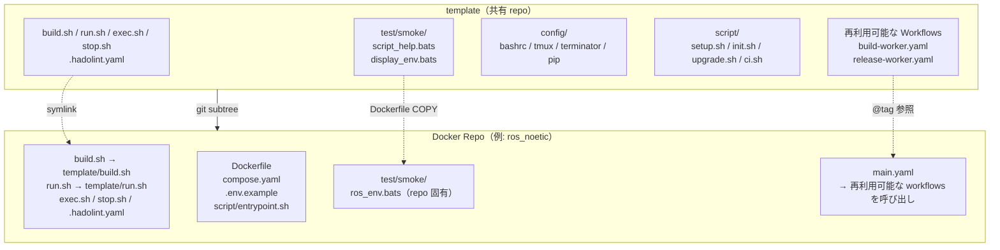
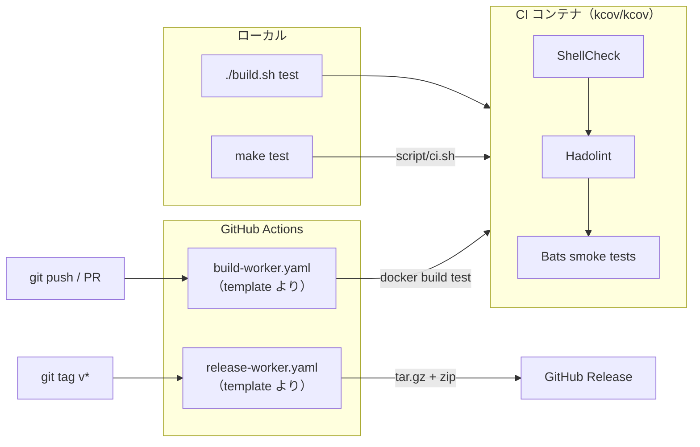

# template

[](https://github.com/ycpss91255-docker/template/actions/workflows/self-test.yaml)
[](https://codecov.io/gh/ycpss91255-docker/template)


[](./LICENSE)

[ycpss91255-docker](https://github.com/ycpss91255-docker) 組織のすべての Docker コンテナ repo 用共有テンプレート。

**[English](../../README.md)** | **[繁體中文](README.zh-TW.md)** | **[简体中文](README.zh-CN.md)** | **[日本語](README.ja.md)**

---

## 目次

- [TL;DR](#tldr)
- [概要](#概要)
- [クイックスタート](#クイックスタート)
- [CI Reusable Workflows](#ci-reusable-workflows)
- [ローカルテスト実行](#ローカルテスト実行)
- [テスト](#テスト)
- [ディレクトリ構造](#ディレクトリ構造)

---

## TL;DR

```bash
# 新規 repo：subtree 追加 + 初期化
git subtree add --prefix=template \
    git@github.com:ycpss91255-docker/template.git main --squash
./template/script/init.sh

# 最新版にアップグレード
make upgrade-check   # 確認
make upgrade         # pull + バージョンファイル + workflow tag 更新

# CI 実行
make test            # ShellCheck + Bats + Kcov
make help            # 全コマンド表示
```

## 概要

本 repo は、すべての Docker コンテナ repo で共有されるスクリプト、テスト、CI workflow を一元管理しています。15 以上の repo で同一ファイルを個別管理する代わりに、各 repo が **git subtree** としてこのテンプレートを取り込み、symlink で参照します。

### アーキテクチャ



### CI/CD フロー



### 含まれるもの

| ファイル | 説明 |
|----------|------|
| `build.sh` | コンテナビルド（`script/setup.sh` を呼び出して `.env` を生成） |
| `run.sh` | コンテナ実行（X11/Wayland 対応） |
| `exec.sh` | 実行中のコンテナに入る |
| `stop.sh` | コンテナの停止・削除 |
| `script/setup.sh` | システムパラメータの自動検出と `.env` 生成 |
| `config/` | シェル設定ファイル（bashrc、tmux、terminator、pip） |
| `test/smoke/` | 各 Docker repo 用の共有テスト |
| `.hadolint.yaml` | 共有 Hadolint ルール |
| `Makefile` | Repo コマンドエントリ（`make build`、`make run`、`make stop` 等） |
| `Makefile.ci` | Template CI コマンドエントリ（`make test`、`make lint` 等） |
| `script/init.sh` | 初回 symlink セットアップ |
| `script/upgrade.sh` | Subtree バージョンアップグレード |
| `script/ci.sh` | CI パイプライン（ローカル + リモート） |
| `.github/workflows/` | 再利用可能な CI workflows（build + release） |

### 各 repo で個別管理するファイル（共有しない）

- `Dockerfile`
- `compose.yaml`
- `.env.example`
- `script/entrypoint.sh`
- `doc/` と `README.md`
- Repo 固有の smoke test

## クイックスタート

### 新規 repo への追加

```bash
# 1. subtree 追加
git subtree add --prefix=template \
    git@github.com:ycpss91255-docker/template.git main --squash

# 2. symlink 初期化（ワンコマンド）
./template/script/init.sh
```

### アップグレード

```bash
# 新バージョンの確認
make upgrade-check

# 最新にアップグレード（subtree pull + バージョンファイル + workflow tag）
make upgrade

# バージョン指定
./template/script/upgrade.sh v0.3.0
```

## CI Reusable Workflows

各 repo のローカル `build-worker.yaml` / `release-worker.yaml` を、本 repo の reusable workflows 呼び出しに置き換えます：

```yaml
# .github/workflows/main.yaml
jobs:
  call-docker-build:
    uses: ycpss91255-docker/template/.github/workflows/build-worker.yaml@v1
    with:
      image_name: ros_noetic
      build_args: |
        ROS_DISTRO=noetic
        ROS_TAG=ros-base
        UBUNTU_CODENAME=focal

  call-release:
    needs: call-docker-build
    if: startsWith(github.ref, 'refs/tags/')
    uses: ycpss91255-docker/template/.github/workflows/release-worker.yaml@v1
    with:
      archive_name_prefix: ros_noetic
```

### build-worker.yaml パラメータ

| パラメータ | 型 | 必須 | デフォルト | 説明 |
|------------|------|------|------------|------|
| `image_name` | string | はい | - | コンテナイメージ名 |
| `build_args` | string | いいえ | `""` | 複数行 KEY=VALUE ビルド引数 |
| `build_runtime` | boolean | いいえ | `true` | runtime stage をビルドするか |

### release-worker.yaml パラメータ

| パラメータ | 型 | 必須 | デフォルト | 説明 |
|------------|------|------|------------|------|
| `archive_name_prefix` | string | はい | - | アーカイブ名プレフィックス |
| `extra_files` | string | いいえ | `""` | 追加ファイル（スペース区切り） |

## ローカルテスト実行

`Makefile.ci`（template ルートから）を使用：
```bash
make -f Makefile.ci test        # フル CI（ShellCheck + Bats + Kcov）docker compose 経由
make -f Makefile.ci lint        # ShellCheck のみ
make -f Makefile.ci clean       # カバレッジレポート削除
make help        # repo ターゲット表示
make -f Makefile.ci help  # CI ターゲット表示
```

直接実行：
```bash
./script/ci.sh          # フル CI（docker compose 経由）
./script/ci.sh --ci     # コンテナ内で実行（compose から呼び出し）
```

## テスト

- **136** テンプレート自身のテスト（`test/unit/`）
- **27** 共有 smoke tests（`test/smoke/`）

詳細は [TEST.md](../test/TEST.md) を参照。

## ディレクトリ構造

```
template/
├── build.sh                          # 共有ビルドスクリプト
├── run.sh                            # 共有実行スクリプト（X11/Wayland）
├── exec.sh                           # 共有 exec スクリプト
├── stop.sh                           # 共有停止スクリプト
├── config/                           # シェル/ツール設定
│   ├── pip/
│   └── shell/
│       ├── bashrc
│       ├── terminator/
│       └── tmux/
├── script/
│   ├── setup.sh                      # .env ジェネレータ
│   ├── init.sh                       # Symlink セットアップ
│   ├── upgrade.sh                    # Subtree バージョンアップグレード
│   ├── ci.sh                         # CI パイプライン（ローカル + リモート）
├── test/
│   ├── smoke/                   # 各 repo 用の共有テスト
│   │   ├── test_helper.bash
│   │   ├── script_help.bats
│   │   └── display_env.bats
│   └── unit/                         # テンプレート自身のテスト（132 件）
├── Makefile                          # 統一コマンドエントリ（make test/lint/...）
├── compose.yaml                      # Docker CI ランナー
├── .hadolint.yaml                    # 共有 Hadolint ルール
├── .github/workflows/
│   ├── self-test.yaml                # テンプレート CI（script/ci.sh を呼び出し）
│   ├── build-worker.yaml             # 再利用可能なビルド workflow
│   └── release-worker.yaml           # 再利用可能なリリース workflow
├── doc/
│   ├── readme/                       # README 翻訳
│   ├── test/                         # TEST.md + 翻訳
│   └── changelog/                    # CHANGELOG.md + 翻訳
├── .codecov.yaml
├── .gitignore
├── LICENSE
└── README.md
```
