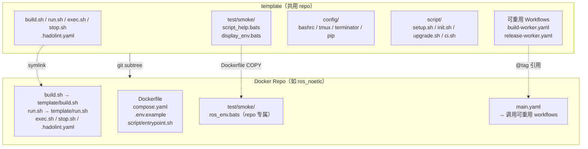
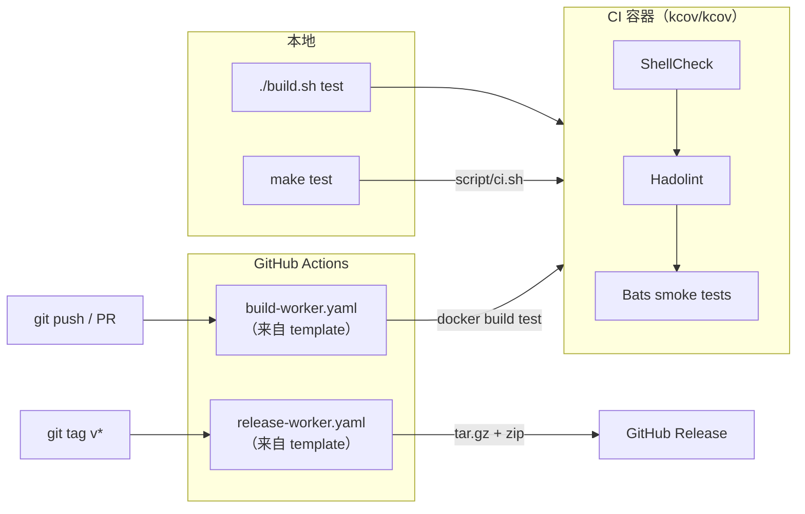

# template

[](https://github.com/ycpss91255-docker/template/actions/workflows/self-test.yaml)
[](https://codecov.io/gh/ycpss91255-docker/template)


[](./LICENSE)

[ycpss91255-docker](https://github.com/ycpss91255-docker) 组织下所有 Docker 容器 repo 的共用模板。

**[English](../../README.md)** | **[繁體中文](README.zh-TW.md)** | **[简体中文](README.zh-CN.md)** | **[日本語](README.ja.md)**

---

## 目录

- [TL;DR](#tldr)
- [概述](#概述)
- [快速开始](#快速开始)
- [CI Reusable Workflows](#ci-reusable-workflows)
- [本地运行测试](#本地运行测试)
- [测试](#测试)
- [目录结构](#目录结构)

---

## TL;DR

```bash
# 新 repo：添加 subtree + 初始化
git subtree add --prefix=template \
    git@github.com:ycpss91255-docker/template.git main --squash
./template/script/init.sh

# 升级到最新版
make upgrade-check   # 检查
make upgrade         # pull + 更新版本文件 + workflow tag

# 运行 CI
make test            # ShellCheck + Bats + Kcov
make help            # 显示所有命令
```

## 概述

此 repo 集中管理所有 Docker 容器 repo 共用的脚本、测试和 CI workflow。各 repo 通过 **git subtree** 拉入此模板，并使用 symlink 引用共用文件。

### 架构



### CI/CD 流程



### 包含内容

| 文件 | 说明 |
|------|------|
| `build.sh` | 构建容器（调用 `script/setup.sh` 生成 `.env`） |
| `run.sh` | 运行容器（支持 X11/Wayland） |
| `exec.sh` | 进入运行中的容器 |
| `stop.sh` | 停止并移除容器 |
| `script/setup.sh` | 自动检测系统参数并生成 `.env` |
| `config/` | Shell 配置文件（bashrc、tmux、terminator、pip） |
| `test/smoke/` | 给各 Docker repo 使用的共用测试 |
| `.hadolint.yaml` | 共用 Hadolint 规则 |
| `Makefile` | Repo 命令入口（`make build`、`make run`、`make stop` 等） |
| `Makefile.ci` | Template CI 命令入口（`make test`、`make lint` 等） |
| `script/init.sh` | 首次初始化 symlinks |
| `script/upgrade.sh` | Subtree 版本升级 |
| `script/ci.sh` | CI pipeline（本地 + 远端） |
| `.github/workflows/` | 可重用 CI workflows（build + release） |

### 各 repo 自行维护的文件（不共用）

- `Dockerfile`
- `compose.yaml`
- `.env.example`
- `script/entrypoint.sh`
- `doc/` 和 `README.md`
- Repo 专属的 smoke test

## 快速开始

### 添加到新 repo

```bash
# 1. 添加 subtree
git subtree add --prefix=template \
    git@github.com:ycpss91255-docker/template.git main --squash

# 2. 初始化 symlinks（一个命令搞定）
./template/script/init.sh
```

### 升级

```bash
# 检查是否有新版
make upgrade-check

# 升级到最新（subtree pull + 版本文件 + workflow tag）
make upgrade

# 或指定版本
./template/script/upgrade.sh v0.3.0
```

## CI Reusable Workflows

各 repo 将本地的 `build-worker.yaml` / `release-worker.yaml` 替换为调用此 repo 的 reusable workflows：

```yaml
# .github/workflows/main.yaml
jobs:
  call-docker-build:
    uses: ycpss91255-docker/template/.github/workflows/build-worker.yaml@v1
    with:
      image_name: ros_noetic
      build_args: |
        ROS_DISTRO=noetic
        ROS_TAG=ros-base
        UBUNTU_CODENAME=focal

  call-release:
    needs: call-docker-build
    if: startsWith(github.ref, 'refs/tags/')
    uses: ycpss91255-docker/template/.github/workflows/release-worker.yaml@v1
    with:
      archive_name_prefix: ros_noetic
```

### build-worker.yaml 参数

| 参数 | 类型 | 必填 | 默认值 | 说明 |
|------|------|------|--------|------|
| `image_name` | string | 是 | - | 容器镜像名称 |
| `build_args` | string | 否 | `""` | 多行 KEY=VALUE 构建参数 |
| `build_runtime` | boolean | 否 | `true` | 是否构建 runtime stage |

### release-worker.yaml 参数

| 参数 | 类型 | 必填 | 默认值 | 说明 |
|------|------|------|--------|------|
| `archive_name_prefix` | string | 是 | - | Archive 名称前缀 |
| `extra_files` | string | 否 | `""` | 额外文件（空格分隔） |

## 本地运行测试

使用 `Makefile.ci`（在 template 根目录）：
```bash
make -f Makefile.ci test        # 完整 CI（ShellCheck + Bats + Kcov）通过 docker compose
make -f Makefile.ci lint        # 只运行 ShellCheck
make -f Makefile.ci clean       # 清除覆盖率报告
make help        # 显示 repo 命令
make -f Makefile.ci help  # 显示 CI 命令
```

或直接运行：
```bash
./script/ci.sh          # 完整 CI（通过 docker compose）
./script/ci.sh --ci     # 在容器内运行（由 compose 调用）
```

## 测试

- **136** 个 template 自身测试（`test/unit/`）
- **27** 个共用 smoke tests（`test/smoke/`）

详见 [TEST.md](../test/TEST.md)。

## 目录结构

```
template/
├── build.sh                          # 共用构建脚本
├── run.sh                            # 共用运行脚本（X11/Wayland）
├── exec.sh                           # 共用 exec 脚本
├── stop.sh                           # 共用停止脚本
├── config/                           # Shell/工具配置
│   ├── pip/
│   └── shell/
│       ├── bashrc
│       ├── terminator/
│       └── tmux/
├── script/
│   ├── setup.sh                      # .env 生成器
│   ├── init.sh                       # Symlink 设置
│   ├── upgrade.sh                    # Subtree 版本升级
│   ├── ci.sh                         # CI pipeline（本地 + 远端）
├── test/
│   ├── smoke/                   # 给各 repo 使用的共用测试
│   │   ├── test_helper.bash
│   │   ├── script_help.bats
│   │   └── display_env.bats
│   └── unit/                         # 模板自身测试（132 个）
├── Makefile                          # 统一命令入口（make test/lint/...）
├── compose.yaml                      # Docker CI 运行器
├── .hadolint.yaml                    # 共用 Hadolint 规则
├── .github/workflows/
│   ├── self-test.yaml                # 模板 CI（调用 script/ci.sh）
│   ├── build-worker.yaml             # 可重用构建 workflow
│   └── release-worker.yaml           # 可重用发布 workflow
├── doc/
│   ├── readme/                       # README 翻译
│   ├── test/                         # TEST.md + 翻译
│   └── changelog/                    # CHANGELOG.md + 翻译
├── .codecov.yaml
├── .gitignore
├── LICENSE
└── README.md
```
