# Pack Log [](https://github.com/ycpss91255/pack_log/actions) [](https://codecov.io/gh/ycpss91255/pack_log)


> **语言**: [English](../../README.md) | [繁體中文](README.zh-TW.md) | 简体中文 | [日本語](README.ja.md)

> **TL;DR** — 单文件 Bash 脚本，通过 SSH 连接到远程主机，按时间范围查找 log 文件，再用 rsync/scp/sftp 传回本机。Bats + Kcov 测试。
>
> ```bash
> ./pack_log.sh -n 1 -s 260115-0000 -e 260115-2359   # 按主机编号
> ./pack_log.sh -u myuser@10.90.68.188 -s ... -e ...          # 直接指定 user@host
> ./pack_log.sh -l -s ... -e ...                               # 本机模式
> ```

专为机器人车队部署设计的 log 收集工具。自动处理 SSH 连接建立、支持动态 token 解析的时间范围 log 搜索，以及文件传输回本机。

## 功能特点

- **多主机支持**：预设主机列表交互式选择，或直接输入 `user@host`。
- **智能 Log 搜索**：Token 系统支持动态路径解析 — 环境变量（`<env:VAR>`）、Shell 指令（`<cmd:command>`）、日期格式（`<date:%Y%m%d>`）。扩展名直接写在 pattern 中（例如 `*.log`）。
- **时间范围筛选**：在指定时间窗口内搜索 log 文件，自动扩展边界确保不遗漏。
- **自动 SSH 密钥管理**：自动创建 SSH 密钥、复制到远程主机、处理 host key 更新。
- **灵活传输方式**：支持 rsync、scp、sftp，自动检测可用工具并依序尝试。
- **本机模式**：不走 SSH，直接在本机收集 log。
- **i18n 多语言支持**：英文、繁体中文、简体中文、日文，通过 `--lang` 或 `$LANG` 切换。
- **Log 文件输出**：所有操作记录写入 `pack_log.log`。
- **模拟执行模式**：预览会收集哪些文件，不做任何复制或传输（`--dry-run`）。
- **传输重试与保留**：文件传输（rsync/scp/sftp）失败时自动重试，最多 3 次，每次间隔 5 秒，能处理 broken pipe 或网络中断等暂时性错误。若全部重试失败，远程临时文件夹会保留以供手动取回。
- **自动归档**：收集完成后自动在输出文件夹旁生成 `.tar.gz`，方便携带与分享。失败时交互提示 `[R] 重试 / [K] 仅保留文件夹 / [A] 中止`。`--dry-run` 不会归档。
- **动态输出命名**：输出文件夹默认为 `/tmp/<script_name>_<host>_<YYMMDD-HHMMSS>`，脚本名由文件名自动获取。将 `pack_log.sh` 改名为 `my_tool.sh` 后，输出文件夹会自动变成 `my_tool_<host>_...`，方便同时运行多个实例。`-n` 模式使用 HOSTS 显示名，`-l`/`-u` 模式使用 hostname。可用 `-o` 覆盖。
- **存活指示器 (Liveness Spinner)**：SSH 连接、远程 find、复制、归档、计算文件夹大小等缓慢操作会显示旋转动画，避免误认为程序卡住。非交互终端（CI、pipe）改打印单行状态，保持 log 干净。
- **干净的 Ctrl-C 中止**：任何阶段按 Ctrl-C 都会在 1 秒内清除临时文件夹并以 exit code 130 结束。
- 439 个测试，涵盖单元测试、本机集成测试、远程集成测试。CI 以非 root 用户运行。

## 快速开始

### 基本使用

```bash
# 交互式选择主机
./pack_log.sh -s 260115-0000 -e 260115-2359

# 按主机编号（HOSTS 数组）
./pack_log.sh -n 1 -s 260115-0000 -e 260115-2359

# 直接指定 user@host
./pack_log.sh -u myuser@10.90.68.188 -s 260115-0000 -e 260115-2359

# 本机模式（不走 SSH）
./pack_log.sh -l -s 260115-0000 -e 260115-2359

# 自定义输出文件夹 + 详细输出
./pack_log.sh -n 1 -s 260115-0000 -e 260115-2359 -o /tmp/my_logs -v

# 使用 token 自定义输出文件夹名称
./pack_log.sh -n 7 -s 260309-0000 -e 260309-2359 -o 'corenavi_<date:%m%d>_#<num>'

# 模拟执行 — 查看会收集哪些文件，不做实际操作
./pack_log.sh -n 1 -s 260115-0000 -e 260115-2359 --dry-run
```

### 命令行选项

| 选项 | 说明 |
|------|------|
| `-n, --number` | 主机编号（对应 `HOSTS` 数组） |
| `-u, --userhost <user@host>` | 直接指定 SSH 目标 |
| `-l, --local` | 本机模式（不走 SSH） |
| `-s, --start <YYmmdd-HHMM>` | 起始时间 |
| `-e, --end <YYmmdd-HHMM>` | 结束时间 |
| `-o, --output <path>` | 输出文件夹路径（支持 `<num>`, `<name>`, `<date:fmt>` token） |
| `-v, --verbose` | 启用详细输出 |
| `--very-verbose` | 启用 debug 输出 |
| `--extra-verbose` | 启用追踪输出（`set -x`） |
| `--dry-run` | 模拟执行：搜索文件但不复制或传输 |
| `--lang <code>` | 语言：`en`、`zh-TW`、`zh-CN`、`ja` |
| `-h, --help` | 显示说明 |
| `--version` | 显示版本 |

## 架构

### 执行流程

```mermaid
graph LR
    A["pack_log.sh\nmain()"]:::entry

    A --> B["option_parser\ngetopt 解析命令行"]:::step
    B --> C["host_handler\n解析目标主机"]:::step
    C --> D["time_handler\n验证时间范围"]:::step
    D --> E{"HOST == local?"}:::decision

    E -->|否| F["ssh_handler\nSSH 密钥 + 连接"]:::step
    F --> G["get_tools_checker\nrsync / scp / sftp"]:::step
    G --> H["folder_creator"]:::step

    E -->|是| H

    H --> I["get_log\n搜索 + 复制文件"]:::step
    I --> J{"HOST == local?"}:::decision

    J -->|否| K["file_sender\n传输回本机"]:::step
    K --> M["archive_save_folder\n创建 .tar.gz"]:::step
    J -->|是| M
    M --> L["完成"]:::output

    classDef entry fill:#1a5276,color:#fff,stroke:#2980b9
    classDef step fill:#8B6914,color:#fff,stroke:#c8960c
    classDef decision fill:#6c3483,color:#fff,stroke:#8e44ad
    classDef output fill:#1e8449,color:#fff,stroke:#27ae60
```



### LOG_PATHS Token 系统

Log 路径支持在运行时对远程主机动态解析的 token：

| Token | 说明 | 示例 |
|-------|------|------|
| `<env:VAR>` | 远程环境变量 | `<env:HOME>/logs` |
| `<cmd:command>` | 远程 shell 指令输出 | `<cmd:hostname>` |
| `<date:format>` | 时间范围筛选用的日期格式 | `<date:%Y%m%d-%H%M%S>` |

扩展名直接写在 pattern 中（例如 `*.pcd`），不需特殊 token。

**处理链**：`string_handler` → `special_string_parser` → `get_remote_value`

**LOG_PATHS 示例**：
```bash
'<env:HOME>/ros-docker/AMR/myuser/log_core::corenavi_auto.<cmd:hostname>.<env:USER>.log.INFO.<date:%Y%m%d-%H%M%S>*'
```

### 指令执行模型

所有远程指令都通过 `execute_cmd()` 执行，将指令字符串以 pipe 方式送入 `bash -ls`（本机或 SSH），借此避免 shell 转义问题。`execute_cmd_from_array()` 则处理以 null 分隔的数组 pipe，用于文件操作。

## 配置

编辑 `pack_log.sh` 顶部的 `HOSTS` 和 `LOG_PATHS` 数组：

```bash
# 目标主机: "显示名称::user@host"
declare -a HOSTS=(
  "server01::myuser@10.90.68.188"
  "server02::myuser@10.90.68.191"
)

# Log 路径: "<路径>::<文件样式>"
declare -a LOG_PATHS=(
  '<env:HOME>/logs::app_<date:%Y%m%d%H%M%S>*.log'
  '<env:HOME>/config::node_config.yaml'
)
```

## 项目目录结构

```text
.
├── pack_log.sh                          # 主脚本
├── ci.sh                                # CI 入口（unit / integration / all）
├── docker-compose.yaml                  # Docker 服务（ci + sshd + integration）
├── .codecov.yaml                        # Codecov 配置
├── .gitignore
│
├── .github/workflows/
│   ├── main.yaml                        # CI 入口 workflow
│   └── test-worker.yaml                 # 测试 jobs（unit + integration）
│
├── test/
│   ├── test_helper.bash                 # 共用 bats 测试 helper
│   ├── test_log_functions.bats          # 日志函数测试 (31)
│   ├── test_support_functions.bats      # 辅助函数测试 (54)
│   ├── test_option_parser.bats          # 选项解析测试 (57)
│   ├── test_host_handler.bats           # 主机选择测试 (22)
│   ├── test_string_handler.bats         # 字符串/Token 处理测试 (36)
│   ├── test_file_finder.bats            # 文件搜索测试 (46)
│   ├── test_file_ops.bats              # 文件操作测试 (73)
│   ├── test_ssh_handler.bats            # SSH 处理测试 (13)
│   ├── test_main.bats                   # Main 流程测试 (35)
│   ├── test_spinner.bats                # 存活指示器测试 (10)
│   ├── test_integration_local.bats      # 本机集成测试 (26)
│   ├── test_integration_sigint.bats     # Signal trap / Ctrl-C 测试 (4)
│   ├── Dockerfile.sshd                  # 远程测试用 SSH 服务器
│   ├── setup_remote_logs.sh             # 远程测试数据创建脚本
│   └── integration/
│       ├── test_helper.bash             # 远程测试 helper
│       └── test_remote.bats             # 远程集成测试 (32)
│
├── doc/
│   ├── README.zh-TW.md                  # 繁体中文 README
│   ├── README.zh-CN.md                  # 简体中文 README
│   └── README.ja.md                     # 日文 README
│
```

## 测试

439 个测试（377 单元 + 30 本机集成 + 32 远程集成）。详见 **[TEST.md](../test/TEST.md)**。

```bash
./ci.sh              # 全部测试（需要 Docker）
./ci.sh unit         # 单元 + ShellCheck + 覆盖率
./ci.sh integration  # 远程集成测试
```

## 重要惯例

- 脚本使用 `set -euo pipefail`，所有错误均为致命错误
- 函数使用 REPLY 惯例作为输出（`REPLY`, `REPLY_TYPE`, `REPLY_STR` 等）
- SSH 密钥路径固定为 `~/.ssh/get_log`
- CI 中强制执行 ShellCheck 合规检查（`-S style` 等级）
- 使用 `BASH_SOURCE` 守卫模式确保可测试性：
  ```bash
  if [[ "${BASH_SOURCE[0]}" == "${0}" ]]; then
    main "$@"
  fi
  ```
