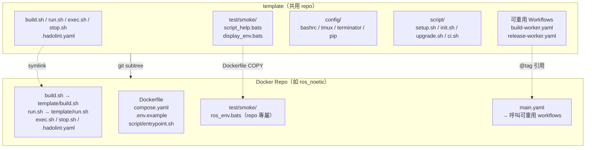
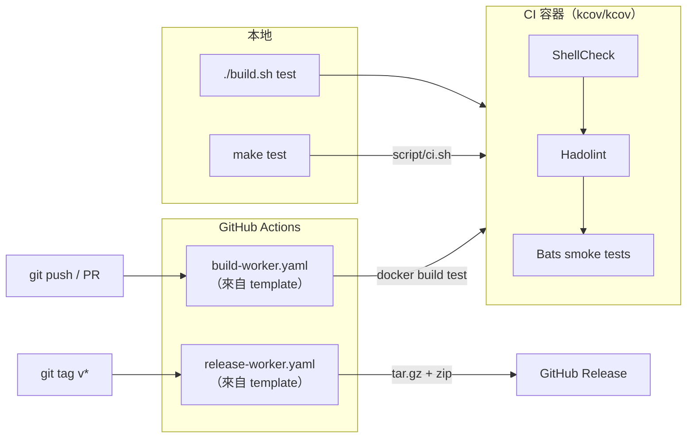

# template

[](https://github.com/ycpss91255-docker/template/actions/workflows/self-test.yaml)
[](https://codecov.io/gh/ycpss91255-docker/template)


[](./LICENSE)

[ycpss91255-docker](https://github.com/ycpss91255-docker) 組織下所有 Docker 容器 repo 的共用模板。

**[English](../../README.md)** | **[繁體中文](README.zh-TW.md)** | **[简体中文](README.zh-CN.md)** | **[日本語](README.ja.md)**

---

## 目錄

- [TL;DR](#tldr)
- [概述](#概述)
- [快速開始](#快速開始)
- [CI Reusable Workflows](#ci-reusable-workflows)
- [本地執行測試](#本地執行測試)
- [測試](#測試)
- [目錄結構](#目錄結構)

---

## TL;DR

```bash
# 新 repo：加入 subtree + 初始化
git subtree add --prefix=template \
    git@github.com:ycpss91255-docker/template.git main --squash
./template/script/init.sh

# 升級到最新版
make upgrade-check   # 檢查
make upgrade         # pull + 更新版本檔 + workflow tag

# 執行 CI
make test            # ShellCheck + Bats + Kcov
make help            # 顯示所有指令
```

## 概述

此 repo 集中管理所有 Docker 容器 repo 共用的腳本、測試和 CI workflow。各 repo 透過 **git subtree** 拉入此模板，並使用 symlink 引用共用檔案。

### 架構



### CI/CD 流程



### 包含內容

| 檔案 | 說明 |
|------|------|
| `build.sh` | 建置容器（呼叫 `script/setup.sh` 產生 `.env`） |
| `run.sh` | 執行容器（支援 X11/Wayland） |
| `exec.sh` | 進入執行中的容器 |
| `stop.sh` | 停止並移除容器 |
| `script/setup.sh` | 自動偵測系統參數並產生 `.env` |
| `config/` | Shell 設定檔（bashrc、tmux、terminator、pip） |
| `test/smoke/` | 給各 Docker repo 使用的共用測試 |
| `.hadolint.yaml` | 共用 Hadolint 規則 |
| `Makefile` | Repo 指令入口（`make build`、`make run`、`make stop` 等） |
| `Makefile.ci` | Template CI 指令入口（`make test`、`make lint` 等） |
| `script/init.sh` | 首次初始化 symlinks |
| `script/upgrade.sh` | Subtree 版本升級 |
| `script/ci.sh` | CI pipeline（本地 + 遠端） |
| `.github/workflows/` | 可重用 CI workflows（build + release） |

### 各 repo 自行維護的檔案（不共用）

- `Dockerfile`
- `compose.yaml`
- `.env.example`
- `script/entrypoint.sh`
- `doc/` 和 `README.md`
- Repo 專屬的 smoke test

## 快速開始

### 加入新 repo

```bash
# 1. 加入 subtree
git subtree add --prefix=template \
    git@github.com:ycpss91255-docker/template.git main --squash

# 2. 初始化 symlinks（一個指令搞定）
./template/script/init.sh
```

### 升級

```bash
# 檢查是否有新版
make upgrade-check

# 升級到最新（subtree pull + 版本檔 + workflow tag）
make upgrade

# 或指定版本
./template/script/upgrade.sh v0.3.0
```

## CI Reusable Workflows

各 repo 將本地的 `build-worker.yaml` / `release-worker.yaml` 替換為呼叫此 repo 的 reusable workflows：

```yaml
# .github/workflows/main.yaml
jobs:
  call-docker-build:
    uses: ycpss91255-docker/template/.github/workflows/build-worker.yaml@v1
    with:
      image_name: ros_noetic
      build_args: |
        ROS_DISTRO=noetic
        ROS_TAG=ros-base
        UBUNTU_CODENAME=focal

  call-release:
    needs: call-docker-build
    if: startsWith(github.ref, 'refs/tags/')
    uses: ycpss91255-docker/template/.github/workflows/release-worker.yaml@v1
    with:
      archive_name_prefix: ros_noetic
```

### build-worker.yaml 參數

| 參數 | 類型 | 必填 | 預設值 | 說明 |
|------|------|------|--------|------|
| `image_name` | string | 是 | - | 容器映像名稱 |
| `build_args` | string | 否 | `""` | 多行 KEY=VALUE 建置參數 |
| `build_runtime` | boolean | 否 | `true` | 是否建置 runtime stage |

### release-worker.yaml 參數

| 參數 | 類型 | 必填 | 預設值 | 說明 |
|------|------|------|--------|------|
| `archive_name_prefix` | string | 是 | - | Archive 名稱前綴 |
| `extra_files` | string | 否 | `""` | 額外檔案（空格分隔） |

## 本地執行測試

使用 `Makefile.ci`（在 template 根目錄）：
```bash
make -f Makefile.ci test        # 完整 CI（ShellCheck + Bats + Kcov）透過 docker compose
make -f Makefile.ci lint        # 只跑 ShellCheck
make -f Makefile.ci clean       # 清除覆蓋率報表
make help        # 顯示 repo 指令
make -f Makefile.ci help  # 顯示 CI 指令
```

或直接執行：
```bash
./script/ci.sh          # 完整 CI（透過 docker compose）
./script/ci.sh --ci     # 在容器內執行（由 compose 呼叫）
```

## 測試

- **136** 個 template 自身測試（`test/unit/`）
- **27** 個共用 smoke tests（`test/smoke/`）

詳見 [TEST.md](../test/TEST.md)。

## 目錄結構

```
template/
├── build.sh                          # 共用建置腳本
├── run.sh                            # 共用執行腳本（X11/Wayland）
├── exec.sh                           # 共用 exec 腳本
├── stop.sh                           # 共用停止腳本
├── config/                           # Shell/工具設定
│   ├── pip/
│   └── shell/
│       ├── bashrc
│       ├── terminator/
│       └── tmux/
├── script/
│   ├── setup.sh                      # .env 產生器
│   ├── init.sh                       # Symlink 設定
│   ├── upgrade.sh                    # Subtree 版本升級
│   ├── ci.sh                         # CI pipeline（本地 + 遠端）
├── test/
│   ├── smoke/                   # 給各 repo 使用的共用測試
│   │   ├── test_helper.bash
│   │   ├── script_help.bats
│   │   └── display_env.bats
│   └── unit/                         # 模板自身測試（132 個）
├── Makefile                          # 統一指令入口（make test/lint/...）
├── compose.yaml                      # Docker CI 執行器
├── .hadolint.yaml                    # 共用 Hadolint 規則
├── .github/workflows/
│   ├── self-test.yaml                # 模板 CI（呼叫 script/ci.sh）
│   ├── build-worker.yaml             # 可重用建置 workflow
│   └── release-worker.yaml           # 可重用發布 workflow
├── doc/
│   ├── readme/                       # README 翻譯
│   ├── test/                         # TEST.md + 翻譯
│   └── changelog/                    # CHANGELOG.md + 翻譯
├── .codecov.yaml
├── .gitignore
├── LICENSE
└── README.md
```
